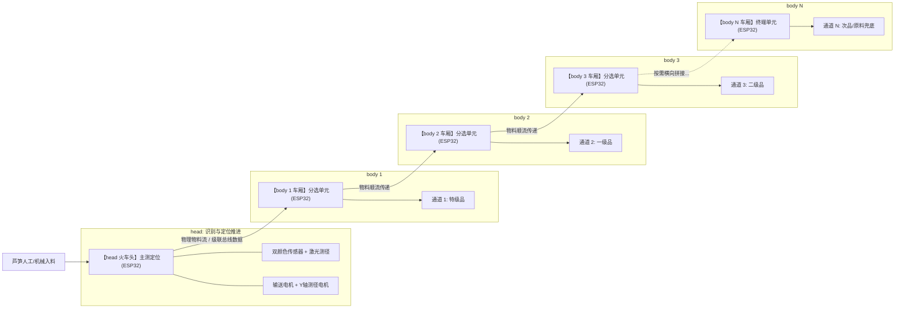

# thin_wall 芦笋智能检测与分级分选系统

本项目是一套面向农业与食品加工场景的**分布式模块化 ESP32 芦笋智能流水线检测与分选系统**。
系统采用类似**“火车头 + 级联车厢 (Locomotive & Cascaded Carriages)”**的前后端解耦架构：
- **`head`（火车头）**：领头前端，负责芦笋的入料识别、测长测径、定位与数据首发；
- **`body`（级联车厢 / Dealer 分牌器）**：由**多个完全相同、硬件标准化**的 ESP32 分选单元串联而成（`body_1` ➔ `body_2` ➔ `body_3` ➔ ... ➔ `body_N`），像火车车厢一样按需无缝横向拼接，实现多级分流与智能分选。

---

## 1. 总体架构设计（火车头 + 级联车厢）

### 1.1 物理流水线与系统拓扑



---

## 2. 子项目职责划分

### 2.1 `head` —— 识别、测长、测径与定位入料系统 (火车头)
- **主控芯片**：ESP32
- **角色定位**：全线的领头调度者与测量基准。
- **核心职责**：
  1. **物料感知与入料推进**：检测芦笋入料，驱动单向输送电机平稳推进定位；
  2. **有效绿长测量**：双 TCS34725 颜色传感器（前哨预警 + 精测量基准）协同工作，动态平滑降速并高精捕捉绿白分界临界点；
  3. **横向直径测量**：Y 轴微光斑激光传感器横向扫描芦笋，精确计算外径尺寸；
  4. **补光控制**：双路 LED 补光灯上电后常亮，保证待机时能可靠识别放料；
  5. **测量数据首发**：将唯一编号、绿长、外径打包向下游级联总线首发广播（**不做定级**，定级由 `body` 完成）。
- **详细文档与引脚配置**：参见 [head/README.md](head/README.md)。

---

### 2.2 `body` —— 模块化分选与分流机构 (级联车厢 / Dealer)
- **主控芯片**：每个分选车厢各搭载 1 片 ESP32。
- **角色定位**：标准化的**分牌器（Dealer）**执行单元，硬件与固件统一设计，支持多节点串联。
- **核心职责**：
  1. **标准化单车厢固件**：一套通用固件代码，通过拨码开关（DIP Switch）或自动拓扑寻址识别自身节点编号（如 Unit #1, #2, #3）；
  2. **总线监听与分选判定 (Dealer 逻辑)**：
     - 实时接收总线上当前通过物料的测量值（绿长、直径）；
     - **本地定级**：各车厢按自身配置的等级规则（绿长/直径区间）判断物料是否属于本车厢；
     - **目标命中**：若物料归属当前车厢的等级（如 Unit #1 负责特级），车厢触发道岔动作（舵机/拨叉/推杆），将物料导入本工位出料仓；
     - **放行传递**：若物料属于更下游等级，当前车厢保持主通道畅通，顺流放行移交给下一节车厢；
  3. **时序与传送带同步**：结合工位距离与流水线速度计算到达延迟（延时队列/光电同步触发），确保动作零失误；
  4. **扩展灵活性**：需要增加分类级别或出料口时，仅需在线路尾部“挂载新车厢”，无需重构既有系统。

---

## 3. 协同机制与通信总线规范

全系统由 1 个 `head` 节点与 $N$ 个 `body` 节点构成分布式局域控制网络：

### 3.1 物理通信架构
- **总线型 / 级联型架构**：
  - **方案 A (RS485 / CAN 总线广播)**：`head` 发出带物料 ID 与测量值的数据包，所有 `body` 节点并行监听，规格命中的车厢提前做好道岔准备；
  - **方案 B (UART 菊花链 Daisy-Chain)**：`head` ➔ `body_1` ➔ `body_2` ➔ ... 逐级中继传递，天然契合物理传输节拍。

### 3.2 典型数据报文示例 (JSON)
`head` 完成测量后发出的流水线数据包：
```json
{
  "item_id": 1024,
  "green_length_mm": 185.4,
  "diameter_mm": 12.8,
  "status": "OK"
}
```

### 3.3 时序协作流程
1. **火车头测定**：`head` 完成芦笋绿长与直径扫描；
2. **总线发放**：`head` 发送测量报文，同时输送电机将芦笋送出交接给流水线输送段；各 `body` 按本地规则判定归属；
3. **车厢接力 (Dealer 响应)**：
   - 非目标车厢：道岔保持直行位，物料平滑穿过；
   - 目标车厢：根据传输时间差提前拨动道岔，精准将芦笋分流截留入仓；
4. **末端兜底**：最后一节车厢收集所有未分流或次品芦笋。

---

## 4. 目录结构

```text
thin_wall/
├── README.md               # 项目总体架构与系统说明 (本文档)
├── AGENTS.md               # 工作空间全局工程规范与行为准则
├── .agents/                # 代理工具、规则与能力定义
├── head/                   # [火车头] 前端识别定位与测长测径系统 (ESP32)
│   ├── README.md           # head 硬件配置、引脚定义与状态机文档
│   └── ...                 # head 源码与 PlatformIO 工程
└── body/                   # [级联车厢] 标准化模块分选分发单元 (Dealer ESP32)
    └── ...                 # body 通用可复用源码与 PlatformIO 工程
```

---

## 5. 软件与技术栈

- **构建系统**：PlatformIO
- **开发框架**：Arduino Core for ESP32
- **架构哲学**：
  - **高内聚、低耦合**：`head` 专心做好高精度测量，`body` 专注于模块化可靠分选；
  - **弹性可扩展**：硬件接口与软件协议标准化，车厢单元可复制化批量部署。

