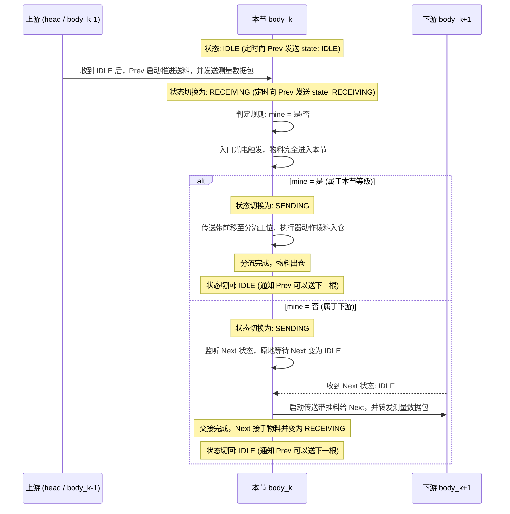

# ESP32 芦笋分选车厢 (body)

## 1. 项目简介与职责

`body` 是 thin_wall 流水线的**分选车厢 (Dealer)**。多节完全相同的车厢串联在 `head` 之后：

```text
head ──> body_1 ──> body_2 ──> ... ──> body_N（兜底）
```

每节车厢只做三件事：
1. **反向背压通告**：定时向上游（前机）通告本节状态（`IDLE` 空闲 / `RECEIVING` 接收中 / `SENDING` 发送中），实行严格互锁；
2. **本地定级与分选**：收到数据包后，用本节存储的规则判定这根芦笋是否归本节。若归本节，动作分流执行器将物料拨入出料仓；
3. **接力交接 (面向下游)**：若不归本节，本节在下游后机变为空闲（`IDLE`）时，启动传送带交接并向下游转发数据；若下游非空闲，必须原地等待。

> [!NOTE]
> - 所有车厢**烧录同一份固件**，差异只来自拨码开关（节点号）和 NVS 中的等级规则；
> - 需要更多等级时，在线路末尾挂载新车厢即可，已有车厢无需改动代码。

---

## 2. 硬件组成

### 2.1 主控
- **MCU**: ESP32-WROOM-32 开发板（与 `head` 同款）。

### 2.2 本节传送带
- **驱动**: 步进电机 + A4988（1/16 细分），与 `head` 的输送电机同型号，便于备件通用；
- **运动**: 按需受控启停。接收上游料、执行分选位移或向下游推料时运转，其余等待时停止；
- **定位方式**: 本节用自身步进电机累计步数精确控制分流点位移与下游交接位移。

### 2.3 入口光电传感器
- 安装在本节传送带的**入口**处，芦笋头部到达时输出遮挡信号，作为物料进入本节物理坐标的原点；
- **传感器选型与物理论证**：由于芦笋直径跨度大（$\phi 6\sim 28\text{mm}$），常规单点激光/红外对射在细笋上易脱靶。详见系统选型论证报告：[《01 - 选型综合论证指南》](wiki/01_entry_sensor_selection_and_analysis.md)、商业落地指南：[《02 - 扁平阵列光纤传感器选型指南》](wiki/02_flat_ribbon_fiber_sensor_guide.md)、自制光幕方案剖析：[《03 - 自制红外光幕方案深度剖析》](wiki/03_diy_infrared_light_curtain_design.md)、自研对射落地规范：[《04 - 单发多收窄角对射光幕深化设计》](wiki/04_single_tx_multi_rx_light_curtain_design.md) 以及自研单侧反射规范：[《05 - 同侧漫反射式红外光幕工程深化设计》](wiki/05_colocated_reflective_infrared_curtain_design.md)。

### 2.4 分流执行器（通用接口，型号待定）
- 位于入口光电传感器下游 `DIVERTER_OFFSET_MM` 处；
- 固件只定义一个**数字输出**：动作时输出有效电平并保持 `DIVERTER_HOLD_MS`，然后恢复；
- 具体采用舵机、电磁铁还是气缸以后决定，仅需补充驱动电路，不影响核心逻辑。

### 2.5 节点号拨码开关
- 4 位拨码开关，可设节点号 1–15（0 保留）；
- 节点号用于日志、反向心跳状态报文和区分各节车厢，**不参与定级判断**。

### 2.6 级联串口（全双工双向菊花链）
- 每节车厢具备两个双向串口：
  - **上游口 `UART_UP`**：
    - RX：接收前机发送的测量数据包；
    - TX：定时向前机发送本节状态心跳（`IDLE` / `RECEIVING` / `SENDING`）；
  - **下游口 `UART_DOWN`**：
    - TX：向后机转发测量数据包；
    - RX：监听后机定时发送的状态心跳（等待后机 `IDLE`）；
- 相邻两节距离超过约 1m 时，每段之间可加一对 RS485 收发器（A/B 双向半双工或 4 线全双工）做抗干扰传输。

### 2.7 电源
- 12V 供电：直供 A4988 的 `VMOT`，DC-DC 降压 5V 供 ESP32；执行器电源按选型另定。全系统共地。

---

## 3. 工作流程与背压互锁机制

### 3.1 核心准则：后机未空闲，前机绝不发送 (背压互锁)

系统严格执行**物料与数据锁步交接原则**：
1. **后机向前机定时上报状态**：
   - 每节车厢以固定周期（默认 `HEARTBEAT_INTERVAL_MS = 50ms`）通过 `UART_UP` 的 TX 向上游发送自身状态包：
     ```json
     {"node": 1, "state": "IDLE"}
     ```
   - 状态枚举：
     - `"IDLE"`: **空闲**。本节已就绪，上游可以交接物料和数据；
     - `"RECEIVING"`: **接收中**。上游物料正在进入本节，上游严禁送入下一根；
     - `"SENDING"`: **发送中/处理中**。本节正在动作分流或正向下游推料，上游严禁送入；
2. **前机放行判据**：
   - 前机（`head` 或上一节 `body`）必须在收到后机明确为 `"IDLE"` 时，才获准启动电机推料交接并发送数据；
   - **只要后机不是 `IDLE`（处于 `RECEIVING`、`SENDING` 或通信超时无响应），前机必须原地停机等待，严禁发送芦笋和数据！**

### 3.2 节点状态流转过程 (Dealer 逻辑)



### 3.3 定级规则

每节车厢在 NVS 中保存**一条**规则：

| 字段 | 含义 |
| :--- | :--- |
| `len_min` / `len_max` | 绿长区间 (mm)，左闭右开 |
| `dia_min` / `dia_max` | 直径区间 (mm)，左闭右开 |
| `catch_all` | 兜底开关：为 `true` 时接收所有到达的芦笋 |

判定逻辑：
- `catch_all = true` → 一律归本节；
- 否则仅当 `status == "OK"`，**且**绿长、直径都落在区间内，才归本节；
- `status` 不是 `OK` 的芦笋（如 `NO_DIAMETER`、`FAULT_*`）不命中任何普通等级规则，最终由兜底车厢接收。

> [!IMPORTANT]
> - 线路**最后一节必须设置 `catch_all = true`**，负责收集所有未命中或异常芦笋；
> - 前面各节区间有重叠时，芦笋归最靠前的命中车厢；有空缺时，落入空缺的芦笋由兜底车厢接收。

### 3.4 规则配置（串口命令，存入 NVS）

通过各节独立的 **UART0（USB 调试口）** 发送单行 JSON 命令配置，写入后掉电不丢：

```json
{"cmd": "set_rule", "len_min": 150, "len_max": 200, "dia_min": 10, "dia_max": 14}
{"cmd": "set_catch_all", "enable": true}
{"cmd": "get_config"}
{"cmd": "reset_state"}
```

- `get_config`: 返回节点号、当前定级规则与实时运行状态；
- `reset_state`: 人工干预或排除卡料后，将状态强制复位为 `IDLE`。

### 3.5 测量数据包格式 (前向传递)

单行 JSON，以 `\n` 结尾，内容与 `head` 保持一致，中间节点**原样转发**，不修改内容：

```json
{"item_id": 1024, "green_length_mm": 185.4, "diameter_mm": 12.8, "status": "OK"}
```

### 3.6 异常与超时保护

| 异常情况 | 处理方式 |
| :--- | :--- |
| 下游后机长时间未报 `IDLE`（超时 `DOWNSTREAM_TIMEOUT_MS`） | 传送带停机原地等待，调试串口报警，不强制推料 |
| 本节接料过程中入口光电未按预期触发（超时） | 判定为卡料/丢料，停机并报 `FAULT_JAM`，状态锁死直到人工复位 |
| 收到非法数据包格式 | 丢弃并告警，本节保持等待状态 |

---

## 4. 推荐 GPIO 引脚规划 (ESP32-WROOM-32)

| 功能 | 信号 | ESP32 GPIO | 说明 |
| :--- | :--- | :--- | :--- |
| **上游串口 `UART_UP`** | RX / TX | GPIO 16 / 17 | UART2；RX 收上游数据，TX 向上游报状态心跳 |
| **下游串口 `UART_DOWN`** | TX / RX | GPIO 25 / 26 | UART1；TX 向下游发数据，RX 监听下游状态心跳 |
| **调试/配置串口** | TXD0 / RXD0 | GPIO 1 / 3 | USB，规则配置与系统日志 |
| **传送带电机** | CONVEYOR_STEP / DIR / EN | GPIO 18 / 19 / 23 | A4988 步进驱动 |
| **入口光电传感器** | ENTRY_SENSOR_PIN | GPIO 32 | 内部上拉，物料遮挡输入 |
| **分流执行器** | DIVERTER_PIN | GPIO 27 | 通用数字输出 (高/低电平脉冲) |
| **节点号拨码开关** | NODE_ID_BIT0–3 | GPIO 21 / 22 / 4 / 33 | 内部上拉，拨到 ON 接地 |
| **状态指示灯** | STATUS_LED | GPIO 2 | 绿色/闪烁指示运行状态 |

---

## 5. 关键配置宏 (`config.h`)

所有车厢共用以下编译期参数：

| 宏 | 默认值 | 说明 |
| :--- | :--- | :--- |
| `STEPS_PER_MM_CONVEYOR` | 80 | 本节传送带电机当量 |
| `CONVEYOR_SPEED_MMPS` | TBD | 本节传送带运行速度 |
| `DIVERTER_OFFSET_MM` | TBD | 入口光电到分流机构的物理位移 |
| `HANDOFF_DISTANCE_MM` | TBD | 向下一节车厢交接时的推进距离 |
| `DIVERTER_HOLD_MS` | TBD | 执行器动作保持时间 |
| `DIVERTER_ACTIVE_LEVEL` | HIGH | 执行器有效电平 |
| `ENTRY_SENSOR_ACTIVE_LEVEL` | LOW | 光电遮挡时的输入电平 |
| `HEARTBEAT_INTERVAL_MS` | 50 | 向上游定时报告状态的周期 (ms) |
| `DOWNSTREAM_TIMEOUT_MS` | 5000 | 等待下游空闲的最大超时时间 (ms) |
| `CHAIN_BAUD` | 115200 | 级联串口波特率 (全线必须一致) |

---

## 6. 软件技术栈
- **构建环境**: PlatformIO
- **开发框架**: Arduino Core for ESP32
- **依赖库**:
  - `waspinator/AccelStepper`（步进电机运动驱动）
  - `bblanchon/ArduinoJson`（数据报文与命令解析）
  - `Preferences`（ESP32 内置 NVS 读写库）
