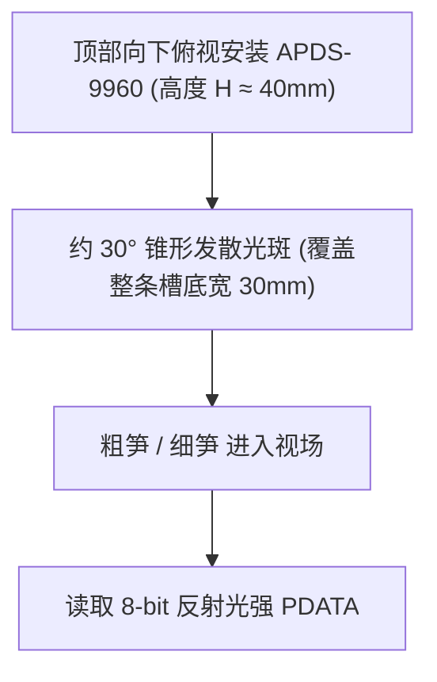

# 01 - body 分选车厢入口芦笋检测传感器方案综合论证与选型指南

**文档编号**: WIKI-BODY-01  
**项目分支**: `body` (ESP32 模块化分选车厢 / Dealer 单元)  
**关联文档**: [02 - 扁平阵列光纤传感器选型采购指南](02_flat_ribbon_fiber_sensor_guide.md) | [03 - 自制红外光幕方案深度剖析](03_diy_infrared_light_curtain_design.md) | [04 - 单发多收窄角对射光幕工程深化设计](04_single_tx_multi_rx_light_curtain_design.md) | [05 - 同侧漫反射式红外光幕工程深化设计](05_colocated_reflective_infrared_curtain_design.md) | [body/README.md](../README.md) | [head/README.md](../../head/README.md) | [head/wiki/08 - APDS-9960 接近检测分析](../../head/wiki/08_apds9960_proximity_detection_analysis.md) | [head/wiki/01 - 芦笋外径测量技术方案论证](../../head/wiki/01_how_to_measure_diameter.md)  
**作者/架构**: thin_wall 工程组  
**状态**: 硬件选型与系统工程论证报告 (Technical RFC & Evaluation)  
**创建时间**: 2026-10-10  

---

## 摘要 (Abstract)

在 `thin_wall` 分布式分选系统中，每一个标准化的 `body`（级联车厢 / Dealer 分牌器）单元都需要在入口位置部署**入口物料检测传感器（Entry Sensor）**。该传感器承担着双重核心使命：
1. **物料进入与接手确认**：配合上游背压握手，确认物料已真实到达本车厢，驱动节点状态机从 `IDLE` 转移至 `RECEIVING`；
2. **在位监控与完全离开判定**：监控物料在传送带上的实时推移行程，并在尾端离开时通知状态机切回 `IDLE` 或进入分流动作；若超时未检测到触发，则判别为丢料或机械卡料（`FAULT_JAM`）。

然而，芦笋作为天然生物农产品，其在线检测面临一个**根本性的物理挑战**：
> **直径跨度极大（细笋 $\phi 6\text{mm}$ 至 粗笋 $\phi 28\text{mm}$），且伴随弯曲、表面水膜与泥水**。

常规的点式对射光电管或点式激光传感器在小直径（$\phi 6 \sim 8\text{mm}$）工况下，极易因“光束射在芦笋上方”而发生**严重漏检（脱靶）**；若将光路压得过低贴近皮带，又极易因传送带震动和表面污渍发生**频繁误触发**。

为彻底攻克该物理瓶颈，工程组对工业界与自研体系下的 **8 大技术方案**（点式红外对射、点式激光、超声波测距、微型激光 ToF、APDS-9960 接近、商用扁平光纤、**自研单发多收窄角对射光幕**、**自研同侧漫反射平行光幕**）展开了全维度的物理建模与横向技术对比，最终给出了高可靠、免调优且兼顾单侧布线便利性的全新工程选型决策矩阵与推荐路线。

---

## 1. 物理难点剖析：为什么小直径芦笋会导致“对射脱靶”？

### 1.1 几何高度盲区困境 (The Geometric Height Dilemma)

当芦笋平躺在传送带或滑槽内沿输送方向前进时，物料在垂直截面上的几何形态如下：

```text
               垂直高度 (Z轴)
                 ▲
                 │
                 │   [光路设定在 H = 10mm] ─── ── ── ── ── ── ── ── ── ── ── ── ── ── ── ──> 漏射!
                 │                     ╭─────────────────────╮
                 │                     │                     │  粗芦笋 (Φ 22mm)
  H = 10mm ──────┼─────────────────────┼── 激光/红外点光束 ──┼──────────────────────> 被有效遮挡!
                 │                     │                     │  (截断高度 10mm)
                 │    ╭───────────╮    ╰─────────────────────╯
                 │    │ 细笋(Φ6mm)│ <--------------------------------- 细笋完全处于光束下方!
  H = 0mm ───────┴────┴───────────┴─────────────────────────────────────────────────> 传送带基准面
```

设传感器单束点光斑中心距传送带底板的高度为 $H_{\text{beam}}$，光斑半径为 $r_{\text{beam}}$：
- **遮挡充要条件**：物料的最高点高度 $Z_{\text{max}} = D_{\text{asparagus}} > H_{\text{beam}} - r_{\text{beam}}$。
- **两难死局**：
  1. **若 $H_{\text{beam}}$ 设得较高（如 $10\text{mm} \sim 15\text{mm}$）**：
     - 能确保不被传送带表面毛刺、皮带接缝或微量积水误触发；
     - 但对于特级细笋（$\phi 6\text{mm} \sim 8\text{mm}$），光束完全从其背部上方擦空飞过，**产生 $100\%$ 的漏检**，系统判定上游未送入物料，引发致命的 `FAULT_JAM` 停机锁死！
  2. **若 $H_{\text{beam}}$ 设得极低（如 $2\text{mm} \sim 3\text{mm}$）**：
     - 理论上能扫到细笋；
     - 但工业传送带运转时普遍存在 $\pm 1 \sim 2\text{mm}$ 的垂直机械跳动、皮带张力浮动与接头颠簸，极其容易将皮带自身抖动误判为芦笋到达；
     - 洗净的芦笋滴水在皮带表面汇聚成水珠，极易切断近底光路导致伪触发。

### 1.2 芦笋弯曲与输送横向漂移

芦笋具有天然微小弯曲度（“月牙形”或“蛇形”）：
- 若安装单点光束垂直照射（从上往下照向传送带反光片）：当芦笋在宽槽（如 $60\text{mm}$ 宽）内前进时，可能靠左走或靠右走，点式光斑极易**打在物料边缘甚至完全漏空**；
- 若水平对射（从左向右横穿输送槽）：芦笋头部若翘起，中段可能下凹贴底，细笋在行进中跳动会导致光束**断续通断**，引起状态机在毫秒内疯狂抖动。

---

## 2. 6 大主流传感器方案深度剖析与横向推演

针对上述工况，我们对以下 6 种潜在选型进行物理机理、优缺点与失效模式的深度推演：

---

### 方案 A：点式红外对射管 (Thru-beam Infrared Photocell)


- **工作原理**：一侧发射 940nm 红外光，另一侧接收。物料通过时切断光束，输出电平翻转（如高电平变低电平）。
- **优势**：
  - 成本极致低廉（一套对射管成本 $< 3$ 元人民币）；
  - 单 GPIO 中断直接响应，时延微秒级，MCU 几乎零计算开销。
- **致命弱点**：
  - **高度容差极差**：受限于单点光束几何限制，前述“细笋漏检 vs 皮带误报”的两难困境无法克服；
  - **农产品水雾穿透力弱**：长期运行后，泥水泥浆容易覆盖发射/接收管小窗口。

---

### 方案 B：点式微光斑激光传感器 (Point Laser - 对射/漫反射)

- **工作原理**：发射 650nm 红光半导体激光，光斑直径极小（$\phi 0.5 \sim 1.0\text{mm}$）。
- **优势**：光斑极其锐利，能量集中，边缘阶跃响应极陡。
- **致命弱点**：
  - **脱靶率比红外管更严重**：因为激光光斑比红外发散角更小、更集中（仅 $1\text{mm}$），对安装位置和物料通过轨迹要求严苛到了极致。细笋稍有偏离或高度不足 $H_{\text{beam}}$，光线直接擦过；
  - **圆柱曲面镜面发散**：若采用漫反射激光探头，芦笋湿润圆柱表面的法线角度急剧变化，光线常被反射散射到其他方向，导致漫反射接收端根本收不到反射回波。

---

### 方案 C：APDS-9960 数字红外接近传感器 (顶部俯视广角感知)

> 详细原理可参阅专篇分析：[08 - APDS-9960 接近检测分析](../../head/wiki/08_apds9960_proximity_detection_analysis.md)。



- **工作原理**：安装在传送带正上方 $30 \sim 50\text{mm}$ 处，垂直向下照射，捕获近红外反射强度 $PDATA$。
- **优势**：
  - **面域锥形视场覆盖，彻底根除脱靶**：光斑发散角约 $30^\circ$，照射到底板形成直径约 $25 \sim 30\text{mm}$ 的广域光斑，无论细笋在槽内偏左还是偏右，只要进入就会产生反射；
  - **不挑高度**：细笋虽反射偏弱，但依然能带来 $\Delta P = 30 \sim 50$ 的读数跳变，绝不会漏检。
- **局限与挑战**：
  - I2C 通信接口（需要占用 ESP32 两个引脚并消耗轮询/中断资源）；
  - 光度强度受表面水膜与粗细影响，固件必须实现**动态基线校准 + 施密特双门限迟滞**；
  - 光学窗口需防泥水溅射。

---

### 方案 D：超声波测距传感器 (Ultrasonic Sensor - 如 RCWL-1601 / US-100 / 工业微型)

```text
       [ 超声波换能器 ]
          /  40kHz  \
         /   声波束  \   发散角约 15° ~ 30°
        /             \
      ╭─────────────────╮
      │ 芦笋 (圆柱截面) │ ---> 圆弧表面将声波向两侧散射，回波微弱!
      ╰─────────────────╯
```

- **工作原理**：发射 40kHz 超声波脉冲，测量声波往返时间 $t$，计算物理距离 $d = \frac{v_{\text{sound}} \cdot t}{2}$。
- **为什么在高速芦笋流水线上极不推荐？**
  1. **近场盲区（Dead Zone）**：常见微型超声波传感器有 $2\text{cm} \sim 4\text{cm}$ 的绝对盲区。若安装距离近，完全无法读数；
  2. **物理声速延迟导致节拍滞后**：声速仅约 $340\text{m/s}$。单次有效测量周期通常需要 $20 \sim 50\text{ms}$，最大采样刷新率仅 $20 \sim 40\text{Hz}$。对于以 $300\text{mm/s}$ 运动的物料，每个采样周期物料已移动了 $10 \sim 15\text{mm}$，边缘定位精度极差；
  3. **圆柱体声波散射（Specular Scattering）**：芦笋表面为圆柱弧面，垂直打下来的声波大部分被弧面反射向斜侧方，垂直反射回接收探头的声能极其微弱，导致“丢波”或测量距离跳变为底板距离。

---

### 方案 E：微型激光飞行时间传感器 (ToF - 如 VL53L0X / VL53L1X / VL6180X)

```text
       [ VL53L0X 传感器 ] 顶部向下俯视 (高度 H₀ = 45mm)
              │  940nm SPAD 飞行时间光子探测
              ▼
       ┌──────────────┐
       │ 细笋 (Φ 6mm) │ ---> 实时测距显示: 39mm  (ΔH = 6mm，明显检出!)
       └──────────────┘
       ──────────────── 传送带底板基准: 45mm
```

- **工作原理**：ST 独有的 FlightSense 技术，发射红外光子并由单光子雪崩二极管（SPAD）阵列接收，直接输出**绝对物理距离（单位：mm）**。
- **突破性优势**：
  - **彻底摆脱反射率与颜色影响**：无论芦笋是深绿、白根、带水膜还是干燥，输出的都是真正的物理高度差！
  - **安装于正上方俯视检测**：
    - 空机时测得基准距离 $H_0 \approx 45\text{mm}$；
    - 当细笋（$\phi 6\text{mm}$）通过时，读数稳定跃变为 $39\text{mm}$（$\Delta H = 6\text{mm}$）；
    - 当粗笋（$\phi 25\text{mm}$）通过时，读数跃变为 $20\text{mm}$（$\Delta H = 25\text{mm}$）；
    - 判定规则简单到极致：**`if (BaseDistance - Distance > 3mm) 物料在位;`**，小直径检出率 $100\%$！
  - **盲区极小**：VL6180X 测量范围 $0 \sim 10\text{cm}$，完全无近距离盲区；VL53L0X 短距模式可在 $20\text{mm} \sim 200\text{mm}$ 极佳工作。
- **缺点**：I2C 接口总线通信；极速模式采样率约 $50\text{Hz}$（$20\text{ms}$ 周期）。

---

### 方案 F：宽光幕/线形扁平光束光电 (Array/Ribbon Light Curtain / 扁平光纤)

```text
     [ 垂直线形发射光幕 ] (如高度 25mm 的多光束/连续面光)
      │ █ █ █ █ █ █ █ █ █ █ █ █ █ │
      │ ═════════════════════════ │
      │ ═════════════════════════ │  细笋无论只有 6mm 高，
      │ ══════════╭────╮═════════ │  只要在 0~25mm 高度范围内穿过，
      │ ══════════│细笋│═════════ │  必能截断最下方的光束段!
      │ ══════════╰────╯═════════ │
      └───────────────────────────┘
```

- **工作原理**：发射端不是单点，而是垂直方向展开的**线形光斑**或**多束密间距红外光栅**（垂直高度覆盖 $0 \sim 25\text{mm}$，光轴间距 $2 \sim 3\text{mm}$）。
- **优势（工业界黄金标准）**：
  - **完美解决高度盲区**：任何处于底板以上 $2\text{mm} \sim 25\text{mm}$ 高度的物体，无论粗细、无论在哪个位置穿过，均无法漏网；
  - **输出极其纯粹**：工业光幕内部集成硬件逻辑电路，对外只输出一个 **NPN/PNP 单路开关量电平（数字量 GPIO）**；
  - **零延迟响应**：硬件电路响应时间 $< 1\text{ms}$，可直接接 ESP32 的外部中断引脚（`GPIO 32`），免除任何软件算法开销；
  - **工业级坚固**：外壳防尘防水（IP65/IP67），耐震动。
- **缺点**：工业对射光幕或槽型宽光幕 BOM 成本相对较高（约 50~150 元）。

---

### 方案 G：自研单发多收窄角对射光幕 (1-Tx 5-Rx + 硬件线或)

> 详细工程设计可参阅专篇：[04 - 单发多收窄角对射光幕工程深化设计](04_single_tx_multi_rx_light_curtain_design.md)。

```text
       【俯视图：单发多收窄角直射与深孔光阑】
       [Tx 窄角发射管 (±15°)] ══════════════════════════> [深孔蜂窝光阑 + Rx1~Rx5 阵列]
                                 (直射光轴高能量覆盖)
```

- **工作原理**：单只 940nm 窄角红外 LED（$\pm 15^\circ$）置于通道一侧，对侧垂直排列 5 只 3mm 窄角光敏三极管（间距 3.5mm，覆盖 17mm 高度）；板载 5 只肖特基二极管构成**硬件线或（Wired-OR）**电路，合成单路中断接入 `GPIO 32`。
- **突破性优势**：
  - **能量极度汇聚**：窄角度使轴向辐射光强暴增 5~10 倍（达 $80 \sim 150\text{mW/sr}$），抗污抗水汽穿透冗余度极强；
  - **物理级抗漫反射绕光**：接收端加设 8mm 深孔蜂窝光阑（FOV 限制在 $\pm 7^\circ$）并配合全域哑光黑腔，外界环境光与侧向二次反射被物理截止；
  - **极致低成本**：整套自研物料成本 **$< 7.00$ 元**，微秒级单 GPIO 中断响应，细笋（$\phi 6\text{mm}$）100% 满遮断。
- **缺点**：需要在流水线两侧分别固定支架并拉线（跨槽走线）。

---

### 方案 H：自研同侧漫反射式排状光幕 (3-Tx 4-Rx + 黑色光阱)

> 详细工程设计可参阅专篇：[05 - 同侧漫反射式红外光幕工程深化设计](05_colocated_reflective_infrared_curtain_design.md)。

```text
       【俯视图：同侧发射接收与对侧 45° 倾斜吸光光阱】
       [同侧 3-Tx 4-Rx 一体化探头] ────── 投射直射光 ──────> [对侧 45° 倾斜吸光光阱]
                                   <···· 芦笋近红外强漫散射   (空机光线被弹飞，无反射!)
```

- **工作原理**：3 只 940nm 发射管与 4 只光敏接收管并排交错安装在流水线**同一侧**。对侧设置 $45^\circ$ 倾斜黑色吸光槽（光阱）。空机时光线射入光阱全部被吸收吸收，全暗截止；芦笋到达时，利用植物细胞对近红外高达 $40\%\sim 60\%$ 的高散射特性漫反射回同侧探头，使对应接收管导通，经开集电极线或输出 `LOW` 脉冲。
- **突破性优势**：
  - **机械施工与走线的最优解**：**全系统仅需安装在单侧**，对外仅引出 1 根 3 芯线（$3.3\text{V}$、$\text{GND}$、$\text{OUT}$），彻底免除跨槽穿线与皮带底板布线；
  - **安装对齐门槛为零**：单侧一体化装配，螺丝拧紧即用，完全不需要两侧精密对光；
  - **物料成本极致低廉**：整套 BOM 成本 **$< 8.00$ 元**，利用开集电极硬件线与，连二极管都不需要。
- **缺点**：对侧必须做消光处理（倾斜光阱或黑色吸光贴）；若探头表面溅满泥浆需定期清洁。

---

## 3. 八大技术方案全维度综合对比矩阵

| 评估维度 | 方案 A<br>点式红外对射 | 方案 B<br>点式激光对射 | 方案 C<br>APDS-9960 接近 | 方案 D<br>超声波测距 | 方案 E<br>微型 ToF (VL53L0X) | 方案 F (商用标杆)<br>松下扁平光纤 | 方案 G (自研首选)<br>单发多收窄角对射 | 方案 H (自研首选)<br>同侧漫反射排状光幕 |
| :--- | :---: | :---: | :---: | :---: | :---: | :---: | :---: | :---: |
| **细笋 ($\phi 6\text{mm}$) 检出率** | 极差 (脱靶率高) | 极差 (擦空率极高) | **极佳 (面域覆盖)** | 中等 (圆柱散射易丢) | **卓越 (高度差判据)** | **极佳 (全高度覆盖)** | **极佳 (下沿满遮断)** | **极佳 (近红外强反射)** |
| **粗笋适应性** | 良好 | 良好 | 良好 (需防饱和) | 良好 | **极佳** | **极佳** | **极佳** | **极佳** |
| **机械布线复杂度** | 双侧跨槽走线 | 双侧跨槽走线 | **单侧顶部俯视** | **单侧顶部俯视** | **单侧顶部俯视** | 双侧光纤入主机 | 双侧跨槽走线 | **极佳 (单侧单线走线)** |
| **对齐与调试难度** | 需精密对光 | 极难对光 | 简单 | 简单 | 简单 | 简单 (宽光斑) | 良好 (深孔限位) | **极佳 (零对齐难度)** |
| **抗传送带跳动/误报** | 差 (低装易误报) | 差 | 良好 (软件去抖) | 良好 | **极佳 (基准面学习)** | **极佳 (盲区可调)** | **极佳 (深孔光阑隔离)** | **极佳 (对侧光阱消除)** |
| **响应时延 (Latency)** | **$< 1\text{ms}$** | **$< 1\text{ms}$** | $\approx 10\text{ms}$ | 差 ($30 \sim 50\text{ms}$) | $\approx 15 \sim 20\text{ms}$ | **$< 1\text{ms}$** | **$< 1\text{ms}$** | **$< 1\text{ms}$** |
| **抗表面水膜/颜色** | 良好 | 中等 | 中等 (需迟滞算法) | 良好 | **极佳** | **极佳** | **极佳** | 良好 (多管冗余) |
| **MCU 引脚与计算开销** | **单 GPIO (零开销)** | **单 GPIO (零开销)** | 占用 I2C (轮询滤波) | 脉宽计数 (阻塞) | 占用 I2C (总线处理) | **单 GPIO (零开销)** | **单 GPIO (硬件线或)** | **单 GPIO (开集电极)** |
| **单套 BOM 成本 (RMB)** | **约 3~5 元** | 约 10~15 元 | 约 8~12 元 | 约 8~15 元 | 约 12~20 元 | 约 160~240 元 | **$\le 7.00$ 元** | **$\le 8.00$ 元** |
| **系统综合推荐指数** | ★★☆☆☆ | ★☆☆☆☆ | ★★★★☆ | ★☆☆☆☆ | ★★★★☆ | ★★★★★ | ★★★★★ | ★★★★★ |

---

## 4. 全新工程选型决策与实施推荐路线

结合当前 `body` 单元硬件架构（`ENTRY_SENSOR_PIN = GPIO 32` 单引脚开关量输入）以及流水线长期运行的综合成本，工程组给出以下全新分级实施推荐：

### 🏆 路线 1：工业免维护与正式量产标杆 —— 方案 F：商用扁平光纤 (松下 FT-A32 + FX-101)
- **推荐场景**：对外交付的正式商业机台、要求开箱即用、零自制外壳打样调试工时；
- **核心优势**：32mm 宽光幕覆盖全量程粗细芦笋，IP67 级金属无源密封探头，自带双数显放大器一键示教；
- **落地成本**：整套约 160 ~ 240 元（国产兼容款约 80~120 元）；直接输出 NPN 开关量接入 `GPIO 32`。

---

### 💡 路线 2：自研极致简便首选（单侧免布线） —— 方案 H：自研同侧漫反射排状光幕 (3-Tx 4-Rx)
- **推荐场景**：自研原型机首选！追求最低的机械施工与布线工作量；
- **核心优势**：
  1. **免除跨槽穿线**：全套传感器仅装在传送带单侧，单根 3 芯线引出直连主板，机械走线槽极度清爽；
  2. **零对齐难度**：单侧一体化探头，无需任何两侧精密对光；
  3. **利用芦笋近红外高反射**：细笋遮挡照亮底层 1~2 个接收管，粗笋照亮全通道，开集电极硬件线与直接输出 `LOW` 脉冲；
- **落地成本**：单套物料成本 **$< 8.00$ 元**；对侧贴一条黑色吸光植绒胶贴即可。

---

### 🛡️ 路线 3：自研极高冗余首选（对射直射式） —— 方案 G：自研单发多收窄角对射光幕 (1-Tx 5-Rx)
- **推荐场景**：恶劣多水雾水溅环境、追求 10 倍以上直射光强冗余度的机台；
- **核心优势**：
  1. **高轴向光强**：窄角聚光管使轴向光通量暴增至 $100\text{mW/sr}$，抗污染裕度极大；
  2. **蜂窝深孔光阑**：接收端 8mm 深孔物理隔断外部环境光与侧向漫反射绕光；
  3. **硬件线或**：5 只肖特基二极管硬件合成 1 根中断线进 `GPIO 32`；
- **落地成本**：单套物料成本 **$< 7.00$ 元**。

---

### 🧭 路线 4：自研智能高度差测量 —— 方案 E：顶部微型 ToF (VL53L0X) 垂直测地
- **推荐场景**：不想在流水线侧面开孔、希望从顶部俯视探测的紧凑机械结构；
- **核心优势**：测量绝对毫米级物理高度差（细笋 $\Delta H = 6\text{mm}$，粗笋 $\Delta H = 25\text{mm}$），判定公式简单坚固（`ΔH > 3.5mm` 即触发），不受物料颜色与水膜反光率影响；
- **落地成本**：模块成本约 15 元；需通过 I2C 接口通信。

---

### 🚫 落后淘汰方案警告（工程明确不推荐）
1. **点式激光（方案 B）**：光斑仅 $\phi 1\text{mm}$，脱靶率全场最高，严禁用于入料定位；
2. **点式红外对射（方案 A）**：高度两难（高装细笋漏检，低装皮带误报），已被方案 G/H 降维替代；
3. **超声波测距（方案 D）**：声速慢（时延 30ms 引起严重位置滞后）、近场盲区大、芦笋圆柱弧面散射严重丢波。

---

## 5. 总结与行动项建议

| 决策维度 | 评定意见与实施指南 |
| :--- | :--- |
| **小直径漏检根因** | 单点光束无法适应 $\phi 6 \sim \phi 28\text{mm}$ 的巨大变径范围，必须采用**线形光幕或多管阵列**进行垂直高度包络覆盖。 |
| **正式商业量产** | 推荐 **方案 F（松下 FT-A32 扁平光纤）**：工业标准、IP67 密封、稳定免维护。 |
| **低成本自研试制** | 首推 **方案 H（同侧漫反射 3-Tx 4-Rx）**：单侧装配走线极爽、零对齐难度、BOM $< 8$ 元；<br>或选 **方案 G（单发多收窄角对射 1-Tx 5-Rx）**：直射光强冗余度极高。 |
| **ESP32 固件接口** | 上述优选方案（F、G、H）对外均输出标准单路开关量，直接接入 **`ENTRY_SENSOR_PIN = GPIO 32`**，**现有固件逻辑 100% 完美复用，无需做任何代码修改**！ |
