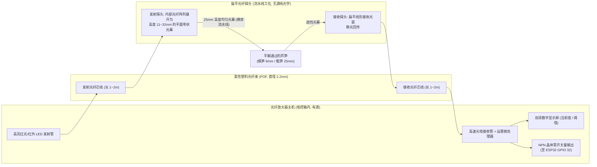

# 02 - 扁平阵列光纤传感器深度技术解析与选型采购指南：解决芦笋小直径脱靶的工业级标配

**文档编号**: WIKI-BODY-02  
**项目分支**: `body` (ESP32 模块化分选车厢 / 入口物料感知)  
**关联文档**: [01 - body 入口芦笋检测传感器方案综合论证](01_entry_sensor_selection_and_analysis.md) | [03 - 自制低成本红外光幕方案深度剖析](03_diy_infrared_light_curtain_design.md) | [body/README.md](../README.md) | [head/wiki/08 - APDS-9960 接近检测分析](../../head/wiki/08_apds9960_proximity_detection_analysis.md)  
**作者/架构**: thin_wall 工程组  
**状态**: 专用硬件器件全景调研与工业采购指引 (Component Engineering Guide & Procurement Matrix)  
**创建时间**: 2026-10-10  

---

## 摘要 (Abstract)

在针对芦笋在线分选流水线的物理工况调研中，普通单点红外对射管和点式激光传感器因受到**芦笋粗细尺寸跨度巨大（$\phi 6\text{mm} \sim \phi 28\text{mm}$）**的严重制约，极易在小直径细笋工况下产生**“光束从物料头顶擦空飞过”的严重脱靶漏检**；若将光路压低贴近皮带，又会被传送带机械抖动和残余水滴引发持续误报。

**扁平阵列光纤传感器（Flat Array / Wide Beam Area Fiber Optic Sensor，工业界常称“区域对射光纤”或“矩阵光纤”）**是彻底终结这一物理困境的工业标准解决方案。

本文对扁平光纤传感器的**内部光学结构、分体式工作原理、流水线适应性优势、国内外主流品牌型号（松下、欧姆龙、基恩士及国产高性价比品牌）、淘宝采购实操与价格区间**进行全面剖析，并提供与 `body` 单元 ESP32 主控（`GPIO 32`）的无缝电气接线与工装设计方案。

---

## 1. 扁平阵列光纤传感器的物理构造与机理

扁平光纤系统采用典型的工业**“分体式（Remote Head + Amplifier）”**架构：由**无源光纤探头（Sensing Head）**与**导轨式光纤放大器主机（Fiber Amplifier）**两部分组成。



### 1.1 探头内部核心结构：从“点光”到“带状光幕”
- **光纤排布原理**：光纤线缆端部内部并不是单一玻璃芯，而是由**数十根直穿微型塑料光纤（Plastic Optical Fiber, POF）**在一字排开的精密铝合金/不锈钢外壳内平行粘接并研磨平整；
- **光学效果**：将放大器发射的点光源转换成一条连续的**垂直扁平光幕（Light Sheet）**。常见探头光幕宽度/高度有 **$11\text{mm}$、$16\text{mm}$、$25\text{mm}$ 和 $32\text{mm}$** 等规格；
- **探头厚度极薄**：整个金属探头厚度通常仅有 **$3.5\text{mm} \sim 5\text{mm}$**，宽度仅约 $10\text{mm}$，极易紧凑镶嵌在狭小的传送带滑槽两侧。

### 1.2 分体式架构的四大工业优势
1. **探头 $100\%$ 无源免维护**：流水线物料侧只有金属壳与塑料光纤，内部**没有任何电路板、芯片、焊点或线圈**，彻底免疫流水线电机的电磁干扰、剧烈机械震动和清洗水汽飞溅（防水防尘达 IP67）；
2. **免除光轴微调苦恼**：由于形成的是宽带状光幕，两侧探头只要大致水平相对安装即可对齐通光，无需像微光斑激光那样耗费数小时精密对光；
3. **主机参数一键设定与数显监控**：放大器安装在安全干燥的电控箱内，外置双数显屏幕（实时光强值与触发阈值），支持**一键示教（Auto-Teaching）**，现场调试极快；
4. **微秒级极致响应速度**：光电转换直接在硬件硬件电路内完成，响应时间通常在 **$25\mu\text{s} \sim 250\mu\text{s}$**，较 I2C 轮询快数千倍，MCU 外部中断瞬时捕捉。

---

## 2. 为什么扁平光纤是芦笋入料检测的完美解法？

针对前述芦笋物理特性，扁平光纤探头展现出降维打击般的优势：

```text
       【流水线入口垂直横截面】
       [发射探头]                                                  [接收探头]
       ┌────────┐                                                  ┌────────┐
       │ █ █ █  │ ════════════════════════════════════════════════ │ █ █ █  │  <-- 光幕上沿 (H = 32mm)
       │ █ █ █  │ ════════════════════════════════════════════════ │ █ █ █  │
       │ █ █ █  │ ═══════════╭─────────────────────╮══════════════ │ █ █ █  │
       │ █ █ █  │ ═══════════│ 粗芦笋 (Φ 22mm)      │══════════════ │ █ █ █  │  <-- 粗笋遮挡大半光幕
       │ █ █ █  │ ═══════════╰─────────────────────╯══════════════ │ █ █ █  │
       │ █ █ █  │ ══════════════╭───────────╮═════════════════════ │ █ █ █  │
       │ █ █ █  │ ══════════════│细笋(Φ6mm) │═════════════════════ │ █ █ █  │  <-- 细笋必定遮挡下沿光束!
       │ █ █ █  │ ══════════════╰───────────╯═════════════════════ │ █ █ █  │
       └────────┘                                                  └────────┘
       ▲                                                           ▲
       └─────── 底沿安装预留 1.5mm (避开皮带接缝与小水珠) ──────────┘
       ────────────────────────────────────────────────────────────────────── 传送带基准面
```

1. **彻底攻克“细笋漏检”**：
   - 探头底沿距带面仅悬空 $1.5\text{mm}$（避开传送带跳动），光幕高度覆盖至 $32\text{mm}$；
   - 细笋即使只有 $\phi 6\text{mm}$，其 $1.5\text{mm} \sim 6\text{mm}$ 的茎身部分必定坚决切断底层光束，使到达接收端的光通量显著下挫，**检出率 $100\%$，绝不脱靶**；
2. **彻底解决“芦笋横向漂移与微小弯曲”**：
   - 物料平躺通过宽槽时，无论紧靠左壁、紧靠右壁还是位于槽中心，横穿而过的光幕全视场覆盖，无死角；
3. **免疫表面水膜与反光率**：
   - 采用的是**对射遮断式（Thru-beam Interruption）**原理，判定依据是“芦笋遮挡了多少光”，而不是“芦笋反射了多少光”，无论表面是深绿嫩茎还是浅白根部，或表皮带有光泽水膜，均能干净利落地阻断光线；
4. **软件零开销**：
   - 放大器输出为纯开关量，直接触发 ESP32 单个 GPIO 外部中断，省去 I2C 复杂通信协议与状态机滤波算法。

---

## 3. 市场主流品牌型号与淘宝供应商全景调研

在淘宝（及 1688 / 工业品电商）采购中，扁平光纤探头与放大器供应商分为**国际工业一线品牌（松下、欧姆龙、基恩士）**与**国内高性价比工控品牌（普邦、博亿精科、希默、拓普泰克等）**两大阵营：

### 3.1 品牌型号全景对照表

| 品牌与系列 | 探头型号（感测头） | 光幕高度/规格 | 推荐放大器主机型号 | 淘宝参考价格区间 (RMB) | 特点与适用场景 |
| :--- | :--- | :---: | :--- | :--- | :--- |
| **松下神视<br>(Panasonic SUNX)**<br>*(行业黄金标杆)* | **`FT-A11`**<br>(小型对射) | **$11\text{mm}$** 宽光幕<br>厚度仅 3.5mm | **`FX-101`** (标准双数显)<br>或 **`FX-501`** (超高速) | 探头：**¥85 ~ ¥180**<br>放大器：**¥35 ~ ¥120**<br>*(整套约 ¥150~¥260)* | **最推荐通用款**。原厂出货量极大，淘宝现货充裕，性能极稳，双数显调试极为友好。 |
| **松下神视<br>(Panasonic SUNX)** | **`FT-A32`**<br>(宽域对射) | **$32\text{mm}$** 宽光幕<br>厚度 4mm | 同上 (`FX-101` / `FX-501`) | 探头：**¥120 ~ ¥240**<br>放大器同上<br>*(整套约 ¥180~¥320)* | **芦笋场景最佳选型**。32mm 高度完全覆盖所有特级粗笋至极细笋全量程。 |
| **欧姆龙<br>(OMRON)** | **`E32-A09`** /<br>`E32-A04` | $11\text{mm}$ 宽光幕 | **`E3X-HD11`** /<br>`E3X-NA11` (双数显) | 探头：**¥150 ~ ¥280**<br>放大器：**¥80 ~ ¥200** | 工业自动化老牌产品，抗干扰能力强，但淘宝上翻新件较多需甄别。 |
| **基恩士<br>(KEYENCE)** | **`FU-A10`** /<br>`FU-E40` | $10\text{mm}$ / $40\text{mm}$ 宽光幕 | **`FS-N41N`** /<br>`FS-N11N` (大功率兆级) | 探头：**¥300 ~ ¥600+**<br>放大器：**¥400 ~ ¥800+** | 顶级光强冗余度与抗污能力，但单套成本偏高，多用于严苛无尘室或重油污环境。 |
| **国产源头优质品牌**<br>(普邦 / 博亿精科 /<br>希默 Simer / 拓普泰克) | **矩阵对射光纤探头**<br>(常标 10mm / 20mm / 30mm) | $10\sim 30\text{mm}$ 宽光束<br>定制槽型/扁平头 | **通用数显光纤放大器**<br>(支持 $\phi 2.2\text{mm}$ 标准接口，NPN 输出) | 探头：**¥30 ~ ¥80**<br>放大器：**¥40 ~ ¥90**<br>*(整套仅 **¥80 ~ ¥150**)* | **极致性价比**。结构通用，插口完全兼容松下/基恩士标准，功能成熟，淘宝现货顺丰直发。 |

---

### 3.2 淘宝采购实操与避坑指南

如果您准备在淘宝直接下单采购，请参考以下实战指引：

#### 1. 淘宝搜索精准关键词推荐
- **买探头搜**：  
  `松下 FT-A11` 或 `松下 FT-A32`（追求原厂稳定）；  
  `区域光纤 探头 对射` 或 `扁平光纤 宽光束` 或 `矩阵对射光纤`（追求经济实惠）。
- **买放大器搜**：  
  `松下 FX-101 NPN` 或 `光纤放大器 数显 NPN`。

#### 2. 核心参数核对“防坑三要素”
1. **输出极性必须选 NPN，严禁选 PNP**：
   - **NPN（常开/常闭可选）**：输出线在动作时下拉至 `0V (GND)`，能够与 ESP32 的 3.3V GPIO 完美安全共地；
   - **PNP**：动作时输出 $12\text{V} \sim 24\text{V}$ 高电平，如果误接直接烧毁 ESP32 引脚！
2. **确认是否配带“放大器连接电缆（插头带线）”**：
   - 很多松下/欧姆龙放大器机身为插拔式接口（如 CN-73-C2 电缆）。低价店家往往只卖裸机身不含线，下单时必须确认**“含输入输出连接线（长 2 米）”**；
3. **光纤探头接口规格确认**：
   - 工业标准光纤线外径通常为 **$\phi 2.2\text{mm}$（或细径 $\phi 1.0\text{mm}$ 配适配器套管）**，主流放大器均支持快插自锁，插拔即用。

---

## 4. 与 ESP32 (`body` 节点) 的硬件对接方案

在当前 `body` 架构中，入口光电引脚为 `ENTRY_SENSOR_PIN = GPIO 32`。光纤放大器的电气连接极其简单直接：

```text
 工业 12V 电源 ──┬──────> [光纤放大器 棕色线 (VCC)]
                 │
                 │   ┌──> [光纤放大器 蓝色线 (GND)]
 系统共同地 (GND) ┴───┴──> ESP32 开发板 GND
 
                           [光纤放大器 黑色线 (NPN 输出)]
                                     │
                                     ├─── [1kΩ 串联保护电阻] ───> ESP32 GPIO 32
                                     │                            (配置 INPUT_PULLUP)
                                     ▼
                     (当芦笋遮挡光幕时，NPN 导通拉低至 GND；
                      当芦笋完全离开时，NPN 截止，内部上拉至 3.3V)
```

### 固件行为特性（完全复用现有代码）
- 在 `body/src/config.h` 中：
  ```cpp
  #define ENTRY_SENSOR_PIN           32
  #define ENTRY_SENSOR_ACTIVE_LEVEL  LOW   // 遮挡时光纤放大器输出低电平
  ```
- 固件仅需通过一个 `attachInterrupt(digitalPinToInterrupt(ENTRY_SENSOR_PIN), onEntryChange, CHANGE)` 或在主循环中以 1ms 间隔轮询该 GPIO，**完全无需复杂的软件滤波**。

---

## 5. 机械工装与安装规范建议

为了彻底排除传送带机械震动和水滴影响，建议按照如下机械规范制作 3D 打印或金属支架：

```text
                 [支架立柱]
                     │
         [微调腰形安装孔 (可上下调节 ±5mm)]
                     │
               ┌─────┴─────┐
               │ 扁平探头   │
               │ (厚 4mm)  │
               └─────┬─────┘
                     │ 光幕下沿
                     ▼
           --------------------- <--- 探头下沿基准线
           ▲ 保持 1.5 ~ 2.0 mm 绝对悬空间隙 (杜绝皮带接头颠簸刮擦)
           ▼
     ═══════════════════════════════════ [传送带上表面]
```

1. **下沿间隙控制在 $1.5 \sim 2.0\text{mm}$**：
   - 保证流水线皮带接头、轻微跳动和偶发水滴不会碰触或遮挡探头光幕；
   - 任何 $\ge \phi 4\text{mm}$ 的细小植物茎体通过时，均能有效遮挡 $1.5\text{mm}$ 以上的光幕；
2. **探头对射间距建议在 $40\text{mm} \sim 80\text{mm}$**：
   - 扁平光纤探头的标称对射检测距离可达 $100\text{mm} \sim 200\text{mm}$，在宽 $50\sim 60\text{mm}$ 的芦笋导槽两侧对射时，通光冗余度极大，穿透轻微水雾能力极强；
3. **日常清洁**：
   - 探头表面为平面，若有泥浆飞溅，停机时使用湿布一擦即净。

---

## 6. 总结与采购决策清单

| 项目 | 推荐方案（方案 A：工业标杆） | 备选方案（方案 B：极致性价比） |
| :--- | :--- | :--- |
| **探头型号** | **松下神视 FT-A32**（32mm 宽光幕对射） | **国产 20~30mm 矩阵对射光纤探头** |
| **放大器型号** | **松下神视 FX-101 (NPN 输出)** | **国产通用数显光纤放大器 (NPN 输出)** |
| **整套采购预算** | **约 ¥180 ~ ¥260 元 / 节点** | **约 ¥80 ~ ¥130 元 / 节点** |
| **购买渠道** | 淘宝搜索 “松下 FT-A32” + “FX-101 NPN 带线” | 淘宝搜索 “矩阵对射光纤 30mm” + “光纤放大器 NPN” |
| **到货可用性** | 现货当天顺丰发货，即插即用 | 现货当天发货，即插即用 |
| **综合评价** | **工业免维护、彻底根治细笋脱靶与误触发的终极利器** | **适合工程样品打样与批量降本** |
