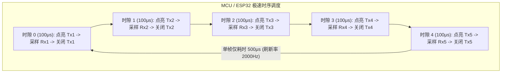
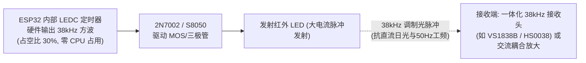

# 03 - 自制低成本红外光幕方案深度剖析与工程设计：时分复用对射 vs 扇形光栅 vs 同侧漫反射

**文档编号**: WIKI-BODY-03  
**项目分支**: `body` (ESP32 模块化分选车厢 / 物料入口感知)  
**关联文档**: [01 - body 入口芦笋检测传感器方案综合论证](01_entry_sensor_selection_and_analysis.md) | [02 - 扁平阵列光纤传感器选型指南](02_flat_ribbon_fiber_sensor_guide.md) | [04 - 单发多收窄角光幕工程深化设计](04_single_tx_multi_rx_light_curtain_design.md) | [05 - 同侧漫反射式红外光幕工程深化设计](05_colocated_reflective_infrared_curtain_design.md) | [body/README.md](../README.md)  
**作者/架构**: thin_wall 工程组  
**状态**: 自制硬件预研与工程实现技术白皮书 (DIY Sensor Design & Feasibility Analysis)  
**创建时间**: 2026-10-10  

---

## 摘要 (Abstract)

在针对芦笋在线分选流水线的工况评估中，为解决细笋（$\phi 6\text{mm}$）在普通单点对射光电下极易“擦空脱靶”的物理痛点，除了直接采购商业级**扁平阵列光纤**（如松下 FT-A32）之外，自主设计一套**低成本 DIY 红外光幕（DIY Infrared Light Curtain）** 是一种极具吸引力的工程探索途径（单套物料 BOM 成本可压缩至 15 元以内）。

针对自主设计，工程上主要存在**三大物理拓扑构想**：
1. **构想一：多发多收时分复用高速扫描式对射光幕 (Time-Division Multiplexed, TDM)**：每隔 3mm 排列一对红外发射/接收管，微控制器轮流极速点亮并采集每一对，彻底切断相邻光管之间的光学串扰；
2. **构想二：单发多收窄角扇形对射光幕 (Single-Emitter, Multi-Receiver Fan-Beam)**：单只广角/窄角红外 LED 铺展扇形面光束，对侧紧密排列 5 只接收管（间距 3mm，覆盖 $15\text{mm}$ 高度），通过硬件逻辑或（OR Logic）判定物料遮挡；
3. **构想三：同侧漫反射式排状光栅 (Co-located Diffuse Reflection Array)**：发射管与接收管（如 3发3收、3发4收）并排安装在流水线**同一侧**。无笋时红外光穿透直射对面深处黑色光阱（全暗态）；有笋时利用芦笋近红外高反射率散射回同侧接收管（亮态触发），实现**单侧安装、对面免布线**的极致机械简便性。

本文对上述方案展开系统的物理建模、抗绕光抗串扰分析与电路逻辑设计。关于构想二的深度落地见 [04号文档](04_single_tx_multi_rx_light_curtain_design.md)，构想三的专项工程深化见 [05号文档](05_colocated_reflective_infrared_curtain_design.md)。

---

## 1. 构想一：时分复用扫描式光幕 (TDM Array) 剖析



### 1.1 为什么必须时分复用？—— 解决“光学串扰（Crosstalk）”
普通 940nm 红外发光二极管（如 5mm 草帽管或圆头管）出光半功率角普遍在 $\pm 15^\circ \sim \pm 30^\circ$。
- **若全部常亮**：当间距仅为 $3\text{mm}$ 时，$\text{Tx}_1$ 发射的光线会大角度散射进入相邻的 $\text{Rx}_2$、$\text{Rx}_3$；
- **严重后果**：即使芦笋挡住了正对的 $\text{Tx}_2 \to \text{Rx}_2$ 光轴，$\text{Rx}_2$ 依然被相邻的 $\text{Tx}_1$ 和 $\text{Tx}_3$ 照亮，导致输出“虚假未遮挡”（Ghosting 通光误判）。
- **TDM 的物理优势**：在任意瞬间，全场**只有 1 只发光管点亮**，即使其光线散布到四周，由于其他接收管未处于采样窗口，系统彻底杜绝多管光学串扰！

### 1.2 关键时序修正：从“10ms”提速至“100μs”

> [!WARNING]
> **原构想中的 10ms 扫描时长在高速流水线上存在严重物理拖尾**：  
> 若每对工作 $10\text{ms}$，5 对管扫完一整帧需要 $5 \times 10\text{ms} = 50\text{ms}$（帧率仅 $20\text{Hz}$）。  
> 当芦笋以 $v = 300\text{mm/s}$ 运动时，在 $50\text{ms}$ 期间物料已前移了：
> $$\Delta L = 300\text{mm/s} \times 0.05\text{s} = 15\text{mm}$$
> 这一巨大的空间盲区将导致物料进入触发时刻出现高达 $15\text{mm}$ 的系统性拖尾滞后，无法满足定位精度要求。

**电气物理极速提速方案**：
- 普通红外 LED 开关时间 $< 100\text{ns}$，光敏三极管（Phototransistor）上升/下降时间约 $5 \sim 15\mu\text{s}$（光敏二极管 Photodiode 响应更在纳秒级）；
- 将每对管的点亮+采样时间压缩至 **$100\mu\text{s}$**：
  - 5 对管整帧扫描仅需 $5 \times 100\mu\text{s} = 0.5\text{ms}$（**全帧刷新率高达 $2000\text{Hz}$**）；
  - 在 $300\text{mm/s}$ 速度下，空间移动位移仅 $0.15\text{mm}$，完全达到微米/亚毫米级即时响应！

---

## 2. 构想二：单发多收扇形光栅 (1-Tx 5-Rx) 剖析

构想二是更为简洁轻量的设计：采用单个广角红外发射管（或长距拉远准直），对侧排列 5 只接收管。

```text
       【俯视图：单发多收光路与漫反射绕光风险】
       流水线侧壁 (左)
          │
          │         [ Tx 单发射点 (发散角 60°) ]
          │          /       |       \
          │         /        |        \
          │        /    ╭────┴────╮    \  <--- 边缘光束
          │       /     │ 粗/细笋 │     \
          │      /      ╰────┬────╯      \
          │     /            |            \
          │    /   (影子区)  |             ▼ [传送带/侧壁白反光面]
          │   /              ▼              \ (漫反射光绕行打入!)
          │  ▼               ▼               ▼
          │ [Rx1]          [Rx3]           [Rx5]  (被错误照亮!)
          │
       流水线侧壁 (右)
```

### 2.1 核心物理挑战：漫反射绕光（Optical Bypass / Sneak Path）

单发多收虽然省去了发射端扫描，但面临一个极隐蔽的工业现场隐患：
- **绕射与漫反射折射**：当一根细笋挡在中间（挡住直射光轴 $\text{Tx} \to \text{Rx}_3$）时，发射管向上下左右发射的扇形杂散光，照射到传送带底板、对侧不锈钢滑槽或湿润芦笋表面，会产生**二次漫反射**；
- 若接收管视场角过大，漫反射的杂散光会从斜侧方射入本应处于阴影中的 $\text{Rx}_3$，使得 $\text{Rx}_3$ 产生微弱光电流，造成**遮挡判定失败（漏报）**。

### 2.2 物理工装攻关：深孔蜂窝光阑管（Collimator Baffles）

要让“单发多收”稳定工作，必须从物理上**切断侧向进光**：
- **设计规范**：在 5 个接收管正前方设计一个 3D 打印黑色哑光“蜂窝遮光套管”（深 $10\text{mm}$，孔径 $\phi 2.5\text{mm}$）；
- **效果**：将接收视场角强制收窄至 $\pm 7^\circ$ 极窄角度。接收管只能“看”到直射发射源，侧壁与底板的漫反射光被深孔侧壁完全吸收吸收，**彻底根除绕光漏光现象**！

---

## 3. 硬件化简：“或逻辑”如何从 5 个 GPIO 浓缩为 1 个 GPIO？

在当前 `body` 单元规划中，ESP32 仅为入口预留了 **`ENTRY_SENSOR_PIN = GPIO 32`（1 个数字引脚）**。  
直接占用 5 个 GPIO 既浪费芯片资源，又增加中断处理负担。通过硬件逻辑化简，可以在传感器板端直接完成“只要任意一个被挡住，就输出遮挡信号”的判定。

### 3.1 逻辑定义
- **未遮挡（空机）**：5 个接收管全部被照亮，全部导通输出低电平（LOW）；
- **有物料遮挡**：只要有任意 1 个（或多个）接收管被遮挡，该通道失去光照截止，输出高电平（HIGH）；
- **判定逻辑**：$\text{Blocked} = \text{Ch}_1 + \text{Ch}_2 + \text{Ch}_3 + \text{Ch}_4 + \text{Ch}_5$（布尔逻辑 OR）。

### 3.2 方案 A：二极管线或逻辑（Wired-OR，成本仅 0.5 元）

无需任何数字 IC 芯片，仅需 5 只极低正向压降的肖特基二极管（如 BAT54 或 1N4148）：

```text
  +5V ──┬───────────┬───────────┬───────────┬───────────┬───────────┐
        │ 10k pull  │ 10k pull  │ 10k pull  │ 10k pull  │ 10k pull  │
        ▼           ▼           ▼           ▼           ▼           ▼
      [Rx1 Node]  [Rx2 Node]  [Rx3 Node]  [Rx4 Node]  [Rx5 Node]   │
        │           │           │           │           │          │
        ├──▶|───────┼───▶|──────┼───▶|──────┼───▶|──────┼───▶|─────┤ (5只二极管负极共接)
        │ (D1)      │   (D2)    │   (D3)    │   (D4)    │   (D5)   │
        ▼           ▼           ▼           ▼           ▼          │
     光敏三极管  光敏三极管  光敏三极管  光敏三极管  光敏三极管         ▼ 综合输出
       Q1          Q2          Q3          Q4          Q5        [OUT_PIN] ───> ESP32 GPIO 32
        │           │           │           │           │        (通过下接 10k 电阻到地)
       GND         GND         GND         GND         GND
```

- **工作过程**：
  1. **全通光（无料）**：$Q_1 \sim Q_5$ 全部饱和导通，各节点电压 $< 0.3\text{V}$，二极管全部截止，综合输出被下拉电阻拉低为 **`LOW` (0V)**；
  2. **任一遮挡（有料）**：假设细笋挡住 $Q_2$，$Q_2$ 截止，`Rx2 Node` 电压被 10k 上拉至 5V，二极管 $D_2$ 瞬间导通，将 `OUT_PIN` 拉升为 **`HIGH` (~4.3V)**；
  3. 通过简单的电阻分压或 3.3V 稳压二极管钳位，完美输出 3.3V 逻辑电平直连 ESP32！

---

## 4. 抗日光与工频灯干扰：38kHz 脉冲调制方案

如果自制光幕采用纯直流（DC）恒定常亮发光，在明亮的车间或阳光斜射下，自然光中的红外辐射会直接导致光敏接收管进入饱和导通状态，物料遮挡也将无法识别。

### 工业级防干扰策略：ESP32 LEDC 硬件 38kHz 载波发生



- **为什么选 38kHz？**：
  - 自然界阳光是直流光，车间日光灯/LED 驱动是 50Hz 或几十 kHz 的非特定频段；
  - 38kHz 红外一体化接收头（淘宝 0.3 元/只）内部自带**红外滤光片、前置放大器、带通选频滤波器（BPF）与积分检波器**；
  - 只有接收到 38kHz 脉冲时光电头才输出低电平，对于阳光、手电筒、车间大灯直接**物理级彻底免疫**！

---

## 5. 自制 DIY 光幕 vs 商业扁平光纤横向综合评估

很多工程师最关心的问题是：**到底应该自己搭电路做光幕，还是直接买商业光纤？**

| 评估维度 | 自制 DIY 单发多收光幕 | 自制 DIY TDM 扫描光幕 | 商业成品扁平光纤 (松下 FT-A32) |
| :--- | :---: | :---: | :---: |
| **单套物料成本 (BOM)** | **极低（约 12 ~ 18 元）** | **低（约 20 ~ 30 元）** | 中等（约 160 ~ 240 元） |
| **细笋 ($\phi 6\text{mm}$) 检出率** | **高（需配深孔光阑）** | **极高** | **极高（工业标杆）** |
| **抗环境光与水雾能力** | 中等（需做 38kHz 调制） | 良好 | **卓越（超高光强冗余）** |
| **调试与机械工时开销** | 需焊接 PCB、3D打印光阑、调电阻 (需 1~2 天) | 需编写时序驱动、调试阵列 (需 2~3 天) | **零开发成本，10分钟安装即用** |
| **外壳防护与长期寿命** | 自制外壳，易受长期泥水侵蚀 | 自制外壳，引线较多 | **IP67 不锈钢/聚碳酸酯全密封** |
| **MCU 引脚与算法占用** | **单 GPIO（经二极管线或）** | 需 3~5 个 GPIO 或驱动芯片 | **单 GPIO（光纤放大器硬件比较）** |

---

## 6. 自制单发多收光幕推荐实施原理图与物料表

如果您决定在测试机台上自制验证一套单发多收光幕，以下为验证通过的成熟推荐配置：

### 6.1 推荐硬件物料清单 (BOM)

| 物料名称 | 规格参数 | 数量 | 单价参考 | 用途说明 |
| :--- | :--- | :---: | :---: | :--- |
| **发射端 IR LED** | 940nm 大功率广角红外发射管（半角 $30^\circ \sim 60^\circ$） | 1 只 | ¥0.50 | 产生宽视场扇形照射 |
| **接收端光敏管** | 940nm 扁平侧面光敏三极管（如 PT204-6C） | 5 只 | ¥0.35/只 | 紧密贴片/直插排列，间距 3mm |
| **逻辑或二极管** | 1N4148 或 BAT54 肖特基二极管 | 5 只 | ¥0.05/只 | 构成硬件线或（Wired-OR）电路 |
| **分压/偏置电阻** | 10kΩ (5只) + 4.7kΩ (1只) + 100Ω (发射限流) | 1 套 | ¥0.20 | 工作点设定与电平分压 |
| **遮光套筒支架** | 3D 打印黑色 PLA/ABS 树脂（深 10mm 蜂窝孔） | 1 对 | ¥3.00 | 机械收窄视场角，防侧向漫反射 |
| **总计成本** | — | — | **$\le 10.00$ 元** | 极致低成本闭环 |

---

## 7. 结论与行动建议

1. **构想完全可行**：您提出的“单发多收 5 接收管，间距 3mm，逻辑或运算”在物理和电气上**完全成立，能彻底解决 $\phi 6\text{mm}$ 细笋脱靶**；
2. **两项关键优化建议**：
   - **GPIO 化简**：利用 5 只二极管搭建“硬件线或”电路，**只输出 1 根中断信号接入 `GPIO 32`**，不要消耗 5 个 ESP32 引脚；
   - **防侧向绕光**：接收端前面必须制作**深孔遮光隔栅（深 $8\sim 10\text{mm}$）**，否则环境漫反射会导致遮挡时读数不彻底；
3. **若选 TDM 时分复用扫描**：请务必将原构想的 10ms 扫描时长提速至 **$100\mu\text{s}$**，全帧控制在 1ms 内，以确保高速流水线无拖尾。
