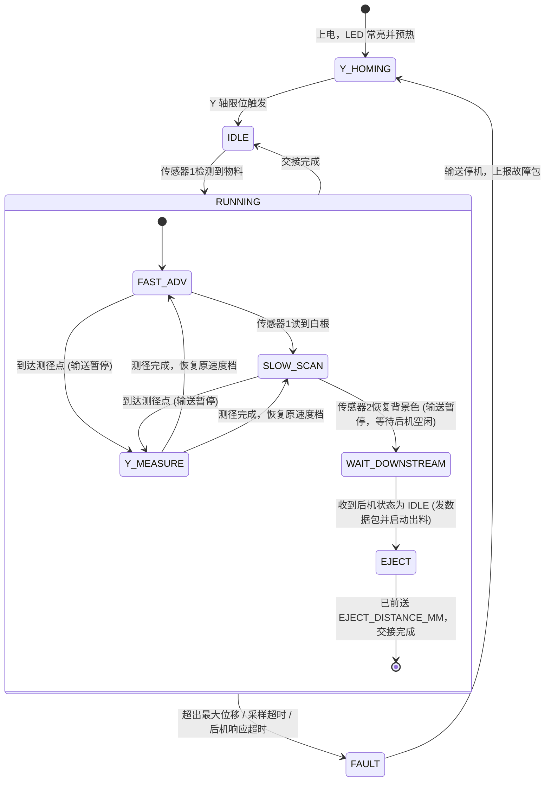

# ESP32 芦笋测长测径单元 (head)

## 1. 项目简介与系统目标
本项目基于 **ESP32** 主控芯片，作为 thin_wall 流水线的 `head`（火车头）单元，构建集**双电机运动控制 (输送电机推料 + Y 轴测径)**、**双颜色传感器协同测长 (前哨降速 + 精准分界)** 与 **激光扫描测径** 于一体的测量系统。

> [!NOTE]
> `head` **只负责测量**，不做等级判定。定级与分选由下游 `body` 车厢根据测量值自行完成（参见 [根目录 README](../README.md)）。

### 核心测量目标
1. **芦笋有效长度 (绿长) 测量**: 测定芦笋头部到根部白化分界点之间的**绿色嫩茎有效长度**（单位：mm）；
2. **芦笋横向直径测量**: 通过 Y 轴横向扫描与微光斑激光传感器，测定芦笋的**外径尺寸**（单位：mm）；
3. **测量数据对外交付**: 通过串口将 `item_id`、有效长度、直径与状态实时发送给下游 `body`。

---

## 2. 硬件架构组成

### 2.1 主控
- **MCU**: ESP32-WROOM-32 开发板 (ESP32-DevKitC 通用款，无 PSRAM；双核 240MHz，双硬件 I2C)

> [!TIP]
> 原型测试与实物实验阶段若采用现成的 **YoraHome ESP32 (Gerber 1.3A)** 32 位三轴主板，其详细硬件架构、完整 GPIO 定义及免改板复用连线方案，请参阅专题文档：[《09 - YoraHome ESP32 (Gerber 1.3A) 现成三轴主板硬件架构、引脚定义 (GPIO) 与 head 单元测试适配全景剖析》](wiki/09_yorahome_esp32_gerber_1.3a_pinout_and_integration.md)。

### 2.2 传感器系统
1. **双 TCS34725 颜色传感器 (安装在入口流水线上，相距固定距离 $D$)**:
   - **传感器 1 (前哨预警)**: 接入硬件 `I2C_0`。负责物料放入触发启动，以及检测到白根进入时提前通知电机降速；
   - **传感器 2 (精测量基准)**: 接入硬件 `I2C_1`。负责捕捉绿头起点 $P_0$，并在低速下捕捉绿白分界点；
   - TCS34725 地址固定为 `0x29`，因此两颗传感器必须分属两条 I2C 总线；
   - **安装间距**: 通过 `SENSOR_DISTANCE_MM` 配置，取值约束见 [§3.2](#32-动态前哨降速与有效长度-绿长-测量)；
   - **积分时间与增益**: 通过 `TCS_INTEGRATION_MS`（默认 24ms，约 40Hz，可切 2.4ms 极速档）与 `TCS_GAIN`（待标定）配置；
   - **补光 LED (常亮)**: 两个传感器各有一路独立补光控制 (`LED_CTRL_1` / `LED_CTRL_2`)：
     - 上电后两路 LED **持续常亮**，保证待机时传感器 1 能可靠识别物料放入；
     - 上电后需等待 `LED_WARMUP_MS` 让光源与读数稳定，期间不响应放料触发；
     - 保留两路独立 GPIO，仅用于故障时关灯；
     - 两路长期同时点亮，需靠**物理遮光罩**避免两个工位之间的光串扰。
2. **激光测径传感器 (对射式微光斑)**:
   - 搭载在 Y 轴滑台上，**光束方向同时垂直于输送方向与 Y 轴**（例如芦笋平躺在传送带上，光束为竖直方向）；
   - 输出遮挡信号（数字电平），由滑台移动过程中遮挡的起止位移差计算直径；
   - 光斑本身有直径，计算时需扣除 `LASER_SPOT_MM`（见 [§3.3](#33-y-轴横向激光扫描与直径测量)）。

### 2.3 运动执行系统 (双步进电机)
1. **输送电机 CONVEYOR (连续单向传输/测长)**:
   - **驱动器**: A4988 步进驱动 (1/16 细分，STEP/DIR/EN 控制)；
   - **传动形式**: 连续单向传动机构 (如传送带，当量 `STEPS_PER_MM_CONVEYOR` = **80 steps/mm**)；
   - **运动特性**: **纯单向移动，无回零、不回退**。运行状态：停止 / 高速前进 / 低速前进 / 测径暂停；
   - **测长前提**: 用输送电机步数换算长度，前提是**芦笋相对传送带不打滑、不滚动**，机械上需用 V 形槽或压轮等方式保证。
2. **Y 轴测径电机 (横向扫描/有回零)**:
   - **驱动器**: A4988 步进驱动 (1/16 细分)；
   - **传动形式**: 垂直于输送方向的线性往复模组，带动激光探头横向扫过芦笋，当量 `STEPS_PER_MM_Y`（待定）；
   - **运动特性**: **具备原点限位**。上电及每次测径完成后自动回零。

### 2.4 电源架构
- **12V 统一供电**: 12V 直供两路 A4988 动力端 (`VMOT` 并联滤波电容)；经 DC-DC 降压输出 5V 供 ESP32，3.3V 供传感器逻辑，全系统共地。

---

## 3. 详细工作流程与协同机制

### 3.1 放入与启动流程
1. 人工或上料机构将芦笋**头朝前 (嫩绿头在前，白根在后)** 放入进料口；
2. 芦笋头部首先遮挡 **传感器 1**（补光常亮，读数从背景色变为物料色）；
3. 系统立即启动 **输送电机高速向前推进**；
4. 芦笋头部到达 **传感器 2**，传感器 2 读到绿色，记录测长起点 $P_0$（当前输送电机累计步数）。

### 3.2 动态前哨降速与有效长度 (绿长) 测量
```text
[进料入口]                                                         [测径工位]
   │                                                                  │
   ├──> 传感器1 (前哨) ────── D ──────> 传感器2 (主测, P₀) ── LASER_OFFSET_MM ──> 激光 ──> 输送方向 ──>
   │
   │  [芦笋状态: 绿头朝前 ═══════════════════════════ 白根在后]
```
1. **高速前移**: 芦笋绿色茎体高速通过；
2. **前哨预警白根**: 芦笋绿白分界到达 **传感器 1** 时，传感器 1 读到**白色**；
3. **提前降速**: 输送电机在剩余的 $D$ 距离内平滑降速；
4. **捕捉分界点**: 同一分界点再前进 $D$ 后到达 **传感器 2**，此时已处于低速，传感器 2 判定绿转白；
5. **计算有效长度 (绿长)**:
   $$\text{Length}_{\text{green}} (\text{mm}) = \frac{\text{Steps}_{\text{boundary}} - P_0}{\text{STEPS\_PER\_MM\_CONVEYOR}}$$
   - 测径暂停期间输送电机不走步，不影响计算结果。
6. **交接出料与后机握手判据 (背压互锁)**:
   - 捕捉白根后输送电机继续低速前移，直到**传感器 2 读数恢复背景色**（芦笋尾部离开）；
   - **检查下游状态 (必须原地等待)**:
     - 输送电机立即暂停，检查下游 `body_1` 的运行状态（通过数据串口 RX 监听）；
     - **若后机处于 `RECEIVING` 或 `SENDING`（或超时未收到状态心跳），输送电机严禁推进，数据包严禁发送，必须原地暂停等待**；
     - **只有检测到后机状态为 `IDLE` (空闲)**，`head` 才向下游发送测量数据包，并启动输送电机推进 `EJECT_DISTANCE_MM`（默认 50mm），将芦笋交接给 `body_1` 的传送带；
   - 推进完成后输送电机停机，系统回到 **IDLE** 待机，等待下一根放入。

**间距 $D$ 的取值约束**:
- **减速距离**: 必须在 $D$ 内从高速降到低速：
  $$\frac{v_{\text{high}}^2 - v_{\text{low}}^2}{2a} \le D$$
- **短绿长情形**: 若绿长 $< D$，传感器 1 会在 $P_0$ 记录之前就看到白根并提前降速。这只会降低节拍，不影响测量精度，无需特殊处理。

**颜色判定（待实测标定）**:
- 绿白过渡是渐变的，不能靠单次读数判断。判据统一为：归一化色度（如 G/(R+G+B) 或色相）跨越阈值，带回差，并连续 `COLOR_CONFIRM_SAMPLES` 次确认；
- 需要标定三组阈值：物料/背景（传感器 1 触发、传感器 2 判断尾部离开）、绿/白（传感器 1 预警、传感器 2 判断分界）。

### 3.3 Y 轴横向激光扫描与直径测量

> [!TIP]
> 关于测量方案的系统级横向对比与技术演进（**方案一：步进激光扫描** vs **方案二：线阵CCD** vs **方案三：全局快门面阵相机+树莓派**），请参阅系统方案论证报告：[《01 - 芦笋外径与长度测量三大技术方案综合论证》](wiki/01_how_to_measure_diameter.md)，以及专门的测径子系统：[《ccd_eye 测径相机》](../ccd_eye/README.md)。

1. **触发与输送暂停**:
   - 测径工位位于传感器 2 下游 `LASER_OFFSET_MM` 处，测量点距芦笋头部 `DIAM_POINT_MM`；
   - 当输送电机自 $P_0$ 起累计前进 `LASER_OFFSET_MM + DIAM_POINT_MM` 时，**输送电机暂停**（高速段或低速段均可能触发）；
   - 芦笋静止后再扫描，避免运动造成的斜向失真。
2. **Y 轴横向扫描**:
   - Y 轴滑台横向扫过芦笋，记录光束开始被遮挡的步数 $Y_{\text{start}}$ 与恢复通光的步数 $Y_{\text{end}}$。
3. **直径计算与恢复推进**:
   $$\text{Diameter} (\text{mm}) = \frac{|Y_{\text{end}} - Y_{\text{start}}|}{\text{STEPS\_PER\_MM}_Y} - \text{LASER\_SPOT\_MM}$$
   - 扫描完成后 Y 轴回零，同时 **输送电机按暂停前的速度档恢复推进**（需确认 Y 轴回程与物料、传送带之间无机械干涉）；
   - 若芦笋尾部在到达测径点前已经离开传感器 2（芦笋过短），则跳过测径，`status` 标记为 `NO_DIAMETER`。

### 3.4 双向通信与后机背压握手协议
- 数据串口由宏定义（`DATA_UART_NUM` / `DATA_UART_TX_PIN` / `DATA_UART_RX_PIN` / `DATA_UART_BAUD`），默认 **UART2，115200**；
- **全双工双向交互**：
  - **TX (前向交接)**：后机处于 `IDLE` 时，发送单行 JSON 测量数据包：
    ```json
    {
      "item_id": 1024,
      "green_length_mm": 185.4,
      "diameter_mm": 12.8,
      "status": "OK"
    }
    ```
  - **RX (反向状态监听)**：接收下游后机（`body_1`）定时广播的设备状态心跳包（周期默认 50ms）：
    ```json
    {
      "node": 1,
      "state": "IDLE"
    }
    ```
    - 后机状态枚举值：
      - `"IDLE"`: 空闲（可以接料与接收数据）；
      - `"RECEIVING"`: 接收中（物料正在进入后机，前机严禁发送）；
      - `"SENDING"`: 发送中 / 执行分选动作中（前机严禁发送）；
- **UART0 (GPIO 1/3) 专用于 USB 下载与调试日志**，不参与工业数据交互。

### 3.5 异常与超时保护机制
- **极简工程原则 (YAGNI)**: 默认人工规范放料，不预设复杂的形状拦截算法；
- **单根节拍**: 一次只处理一根芦笋，回到 IDLE 之前不响应新的放料；
- **后机握手超时**: 若物料测完后下游长时间（超过 `DOWNSTREAM_TIMEOUT_MS`）未上报 `IDLE`，进入告警等待，禁止强制出料；
- **防空转与防卡料**（任意运行状态下都可能触发）:
  - **最大前送位移**: 单次累计位移超过 `MAX_TRAVEL_MM`（如 600mm）仍未完成，强制停机，`status = FAULT_TRAVEL`；
  - **采样超时**: 传感器连续读取失败或超时，输送电机停机，`status = FAULT_SENSOR`；
  - 故障处理：停止输送电机，Y 轴回零，经调试串口打印告警，经数据串口上报故障包，回到 IDLE。

---

## 4. 推荐 GPIO 引脚规划分配表 (ESP32-WROOM-32)

| 功能分组 | 硬件功能 | 模块/设备 | ESP32 GPIO | 说明 |
| :--- | :--- | :--- | :--- | :--- |
| **I2C 总线 0** | SDA0 / SCL0 | TCS34725 #1 (前哨预警) | GPIO 21 / 22 | 硬件 I2C_0 (地址 0x29) |
| **I2C 总线 1** | SDA1 / SCL1 | TCS34725 #2 (精测量) | GPIO 16 / 17 | 硬件 I2C_1 (地址 0x29)；WROVER 模组上被 PSRAM 占用，不可用 |
| **LED 补光控制 1**| LED_CTRL_1 | 传感器 1 补光 | GPIO 15 | 常亮，故障时关闭；启动时会被读取的引脚 (strapping pin)，外部拉低只会关闭启动日志 |
| **LED 补光控制 2**| LED_CTRL_2 | 传感器 2 补光 | GPIO 13 | 常亮，故障时关闭 |
| **输送电机** | CONVEYOR_STEP / DIR / EN | A4988 #1 (输送) | GPIO 18 / 19 / 23 | 单向脉冲、方向、使能控制 |
| **Y 轴测径电机** | STEP / DIR / EN | A4988 #2 (Y轴) | GPIO 25 / 26 / 27 | 往复扫描脉冲、方向、使能 |
| **Y 轴原点限位** | Y_LIMIT_PIN | 微动/光电限位 | GPIO 32 | Y 轴回零信号输入 (唯一硬件限位) |
| **测径激光传感器**| DIAM_LASER_PIN | 对射式激光接收 | GPIO 33 | 遮挡输入信号 (高/低电平) |
| **状态指示/备用** | STATUS_LED | 状态指示灯 | GPIO 4 | 运行/故障指示 (预留) |
| **数据串口** | TXD2 / RXD2 | UART2 (宏可改) | GPIO 14 / 34 | 发往下游 `body`；GPIO 34 为仅输入引脚，适合做 RX |
| **调试串口** | TXD0 / RXD0 | UART0 / USB | GPIO 1 / 3 | 仅用于下载与调试日志 |

---

## 5. 核心状态机架构 (Finite State Machine)



**记录事件（不单独设状态）**:
- 传感器 2 读到绿头时记录 $P_0$（发生在 FAST_ADV 或 SLOW_SCAN 中）；
- 传感器 2 读到绿白分界时记录绿长（发生在 SLOW_SCAN 中）。

---

## 6. 关键配置宏 (`config.h`)

| 宏 | 默认值 | 说明 |
| :--- | :--- | :--- |
| `STEPS_PER_MM_CONVEYOR` | 80 | 输送电机当量 |
| `STEPS_PER_MM_Y` | TBD | Y 轴当量（取决于丝杆/皮带参数） |
| `SENSOR_DISTANCE_MM` | 50 | 两颜色传感器间距 $D$ |
| `CONVEYOR_SPEED_HIGH_MMPS` / `CONVEYOR_SPEED_LOW_MMPS` | TBD | 输送高速 / 低速 |
| `CONVEYOR_ACCEL_MMPS2` | TBD | 输送加减速度，需满足 §3.2 的减速约束 |
| `TCS_INTEGRATION_MS` / `TCS_GAIN` | 24 / TBD | 颜色传感器积分时间与增益 |
| `COLOR_CONFIRM_SAMPLES` | TBD | 颜色判定连续确认次数 |
| `LED_WARMUP_MS` | TBD | 上电后补光预热时间 |
| `LASER_OFFSET_MM` | TBD | 测径工位距传感器 2 的距离 |
| `DIAM_POINT_MM` | TBD | 测量点距芦笋头部的距离 |
| `LASER_SPOT_MM` | TBD | 激光光斑直径 |
| `EJECT_DISTANCE_MM` | 50 | 尾部离开后送入下游车厢的交接距离 |
| `MAX_TRAVEL_MM` | 600 | 单次最大前送位移 |
| `DOWNSTREAM_TIMEOUT_MS` | 5000 | 等待下游车厢空闲的超时时间 |
| `DATA_UART_NUM` / `DATA_UART_BAUD` | 2 / 115200 | 数据串口编号与波特率 |
| `DATA_UART_TX_PIN` / `DATA_UART_RX_PIN` | 14 / 34 | 数据串口引脚 (TX 发往后机, RX 接收后机状态) |

---

## 7. 软件技术栈与构建管理
- **构建环境**: PlatformIO (`platformio.ini`)
- **开发框架**: Arduino Core for ESP32
- **依赖库 (轻量精简)**:
  - `adafruit/Adafruit TCS34725` (颜色传感器驱动)
  - `waspinator/AccelStepper` 或硬件定时器脉冲发生器 (平滑加减速控制)
