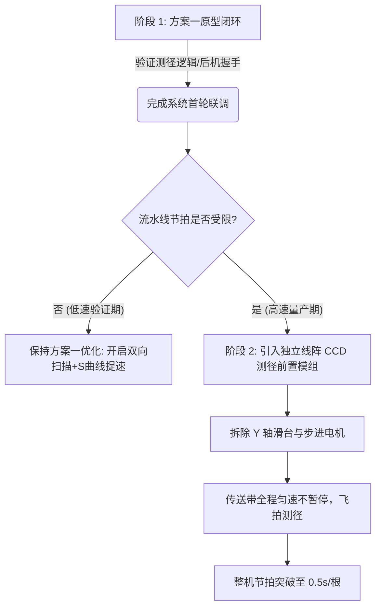

# 01 - 芦笋外径测量技术方案论证报告：步进电机激光扫描 vs 线阵CCD实时成像

**文档编号**: WIKI-HEAD-01  
**项目分支**: `head` (ESP32 芦笋测长测径单元)  
**关联文档**: [02 - 机器视觉光学基础与镜头选型解析](02_optical_concepts_guide.md) | [03 - 线阵 CCD 传感器选型与参数对照](03_linear_ccd_sensors_guide.md) | [04 - 方案二工程深化设计](04_scheme2_linear_ccd_detailed_design.md) | [05 - 线阵 CCD 接口与采集协处理器子系统](05_linear_ccd_interface_board.md)  
**作者/架构**: thin_wall 工程组  
**状态**: 方案论证评审稿 (RFC / Evaluation Paper)  
**创建时间**: 2026-10-10  

---

## 摘要 (Abstract)

在果蔬及农产品（以绿芦笋为典型代表）自动化分级分选流水线中，**茎体有效直径（外径）**是决定等级评定与销售价值的核心形态学指标之一。本文针对 `head`（火车头测长测径单元）的直径在线检测需求，对两种截然不同的物理测量路径进行了系统的工程论证与量化对比：
1. **方案一（机电扫描式）**：步进电机驱动 Y 轴线性滑台带动顶部反射式微光斑激光传感器横向往复扫描；
2. **方案二（光学场测式）**：高分辨率线性阵列 CCD（Linear Array CCD）光学透射/反射单次瞬态成像。

报告从**测量原理、空间/时间测量精度、流水线节拍开销（吞吐率）、机械寿命与可靠性、光学抗扰度、主控（ESP32）算力与接口负载、BOM 硬件成本**等 7 个关键工程维度展开深入剖析。论证结果表明：方案一在原型期具备极高的零配件复用性与低调试门槛，但机械运动带来的停顿（约 400~800ms）是系统节拍的物理瓶颈；方案二具备“飞拍”测量能力与零机械磨损优势，能在微秒级曝光内完成直径提取，但对光学照明均匀度、平行光路与嵌入式数据采集链路提出了更高的工程要求。最后，本报告给出了具体的硬件选型指导与从方案一平滑演进至方案二的技术路线图。

---

## 1. 测量需求与物理背景分析

### 1.1 芦笋物料的物理形态学特性
芦笋不同于工业刚性轴承或规整圆柱工件，其在线检测具备显著的生物物料特征：
- **截面近似性**：横截面近似椭圆或非规则圆形，直径一般在 $8\text{ mm} \sim 28\text{ mm}$ 范围浮动；
- **表面质地与反光**：表皮湿润、带有纵向纤维凹凸，绿段与白段表面对特定波长光的散射率存在差异；
- **抗变形能力**：芦笋质地脆嫩，检测必须采用**非接触式**测量，杜绝卡尺等任何机械夹紧受力；
- **测量基准位置**：根据分级标准，通常测量距离芦笋头部特定距离（如 $L_{\text{point}} = 50\text{ mm} \sim 100\text{ mm}$）处的节间直径。

### 1.2 核心测量指标约束
根据 [head 单元设计规格](../README.md)，直径测量必须满足如下指标：
- **量程范围**：$5.0\text{ mm} \sim 35.0\text{ mm}$；
- **系统测量精度**：误差 $\le \pm 0.2\text{ mm}$，重复定位精度 $\le \pm 0.1\text{ mm}$；
- **系统节拍目标**：整机单根分选总耗时期望控制在 $1.0\text{ s} \sim 1.5\text{ s}$ 内；
- **主控平台**：ESP32-WROOM-32（无 PSRAM，需兼顾双硬件 I2C 颜色采集、输送电机加减速与全双工 UART 后机通信）。

```
        ┌────────────────────────────────────────────────────────┐
        │                 芦笋直径测量方案物理对比                │
        └────────────────────────────────────────────────────────┘

    [方案一：机电移动扫描 (Y-Axis Scanning)]      [方案二：线阵光学投影 (Linear CCD Imaging)]

             步进驱动 Y轴滑台                            线阵 CCD 传感器芯片 (1×N 像素)
              ┌─────────┐                                 ┌───────────────────────┐
              │  Motor  │                                 │ ▀▀▀▀▀▀▀▀▀▀▀▀▀▀▀▀▀▀▀▀▀ │
              └────┬────┘                                 └───────────┬───────────┘
                   │ 往复位移                                          │ 瞬态光学成像 (成像透镜)
            ┌──────▼──────┐                                           │
            │ 微光斑激光器 │                                           │
            └──────┬──────┘                                           │
                   │ 垂直光束 (扫描线)                                 │
                   ▼                                                  ▼
             ╭─────────╮                                        ╭─────────╮
             │ (芦笋)  │ 横截面                                 │ (芦笋)  │ 产生遮挡阴影
             ╰─────────╯                                        ╰─────────╯
            ─────────────                                 ─────────────────────────
             传送带底板                                    平行背光源 (Telecentric Backlight)
```

---

## 2. 方案一：步进电机带动微光斑激光传感器横向扫描

### 2.1 系统架构与工作原理
该方案在机械上传送线测径截面上方架设一条垂直于物料流动方向（输送 $X$ 轴）的横向运动模组（$Y$ 轴）。
- **执行机构**：NEMA17 / NEMA14 步进电机 + 同步带/精密滚珠丝杆 + 原点光电限位开关；
- **传感器选型**：顶部安装反射式微光斑激光光电传感器（或激光三角测距传感器/对射对准探头）。光束垂直向下，光斑直径典型值 $d_{\text{spot}} \approx 0.5\text{ mm} \sim 1.0\text{ mm}$；
- **检测逻辑**：
  1. 输送电机将芦笋指定截面送至测径点后，**输送电机停机锁定**；
  2. Y 轴步进电机驱动激光头从待机位以设定速度 $v_y$ 匀速向另一侧扫过芦笋；
  3. 激光探头照射到底板反射与照射到芦笋表面的回波信号不同（或高度差变动），数字量/模拟量输出产生跳变：
     - 记录探头首次进入芦笋边缘时的步进脉冲计数 $Y_{\text{start}}$；
     - 记录探头脱离芦笋边缘恢复背景反射时的步进脉冲计数 $Y_{\text{end}}$；
  4. 直径换算公式：
     $$D = \frac{|Y_{\text{end}} - Y_{\text{start}}|}{\text{STEPS\_PER\_MM}_Y} - d_{\text{spot\_effective}}$$
  5. Y 轴完成扫描后快速回零（或反向等待下一次扫掠），输送电机解除暂停恢复送料。

```
      反射式激光探头扫描时序波形图:
      
      Y轴位移   0 ─────────── Y_start ────────────── Y_end ────────────> (mm)
      激光感应  [   底板背景   ]┌────── 芦笋茎体 ──────┐[   底板背景   ]
      电平信号  ────────────────┘                      └─────────────────
                                 <──  ΔY 脉冲步数换算 ──>
                                  D = ΔY - 光斑修正补偿
```

### 2.2 误差模型与精度分析
1. **脉冲当量分辨率**：
   若采用 1/16 微步细分、导程 $20\text{ mm}$ 的同步带轮系统：
   $$\text{Resolution} = \frac{20\text{ mm}}{200 \times 16} \approx 0.00625\text{ mm/step}$$
   脉冲量化误差远小于目标精度（$\ll 0.05\text{ mm}$），在控制层面精度极高。
2. **光斑尺寸与边缘展宽效应**：
   激光束不是理想的一维几何线，而是具有高斯能量分布的光斑。当光斑扫过芦笋圆弧边缘时，反射信号强度呈 S 型渐变。若阈值电压漂移或表面倾角过大致使光线散射失真，边缘检测将引入 $\pm 0.1\text{ mm} \sim 0.2\text{ mm}$ 的不确定度。
3. **机械回程间隙（Backlash）**：
   若采用双向扫描策略，同步带换向齿隙会导致测量系统偏差，必须通过软件回程差补偿或强制单向扫描+回零。

### 2.3 核心缺陷：节拍瓶颈与机械磨损
- **动作耗时计算**：
  设有效扫描行程 $40\text{ mm}$，加速段与减速段各 $5\text{ mm}$，最大扫描速度 $100\text{ mm/s}$，回程速度 $150\text{ mm/s}$：
  $$t_{\text{scan}} = \frac{40}{100} + t_{\text{acc}} \approx 0.5\text{ s}$$
  $$t_{\text{return}} = \frac{40}{150} + t_{\text{acc}} \approx 0.35\text{ s}$$
  加上传送带启停的加减速与机械阻尼稳定时间（$\approx 0.15\text{ s}$），单次测径会导致流水线**静止停顿 0.8 ~ 1.0 秒**。
- **机械可靠性**：
  若流水线日处理量为 2 万根芦笋，Y 轴滑台每日需往复运动 4 万次。在潮湿、有菜汁粉尘的农业环境下，导轨与线缆拖链极易磨损发热，维护周期短。

---

## 3. 方案二：线阵 CCD 线性阵列单次光学成像

### 3.1 系统架构与工作原理
该方案基于一维高密度光学感光阵列，将空间几何尺寸直接映射为感光像素数。
> [!IMPORTANT]
> **关键工业防护约束：必须采用左右水平对射布局，严禁上下结构！**  
> 芦笋带有根部泥土、落屑与水汽。若采用上下垂直光路（如光源在下、相机在上），掉落的泥渣会迅速覆盖光源玻璃或镜头，导致系统频繁失效。因此必须采用**左右水平对射光路**（平行背光在左，垂直线阵 CCD 在右），使泥土在重力作用下自然下落至底部排渣槽。  
> 详细光路推导、视窗气帘与工程参数详见：[《04 - 方案二工程深化设计：水平对射式线阵 CCD 光学测径系统与防尘防污架构》](04_scheme2_linear_ccd_detailed_design.md)。

- **核心器件**：
  - **线阵 CCD/CMOS 传感器**（如 Toshiba TCD1304、TCD1209、Sony ILX511 系列，详见下表及专门指南：[《03 - 线阵 CCD 传感器选型与参数对照》](03_linear_ccd_sensors_guide.md)）；
  - **光学系统**：选用 [微距定焦镜头](02_optical_concepts_guide.md#31-微距定焦镜头-macro-fixed-focal-lens) 或 [双远心镜头 (Telecentric Lens)](02_optical_concepts_guide.md#32-双远心镜头-bi-telecentric-lens)，[物方视场 (FOV)](02_optical_concepts_guide.md#2-物方视场-field-of-view-fov) 设计为垂直高度 $H_{\text{FOV}} \approx 45\text{ mm}$（详细原理参见 [《02 - 机器视觉光学基础与镜头选型解析》](02_optical_concepts_guide.md)）；
  - **光源匹配**：位于流水线左侧的狭缝平行高均匀度准直背光源（波长多选 525nm 绿光或 660nm 准直红光），与右侧垂直线阵 CCD 形成**水平横向对射光轴**。

#### 常用工业线阵 CCD 核心参数对照表

| 传感器型号 | 有效像元数 | 像元尺寸 | 感光面长度 | 工作电压 | 典型主频 | 输出幅度 ($V_{\text{SAT}}$) | 驱动复杂度与特性 |
| :--- | :--- | :--- | :--- | :--- | :--- | :--- | :--- |
| **Toshiba TCD1304AP/DG** | **3648 点** | $8\mu\text{m} \times 200\mu\text{m}$ | $29.18\text{ mm}$ | **3.3V 单电源** | $0.5 \sim 4\text{ MHz}$ | $\sim 500\text{ mV}$ (需运放) | 3线控制，内置电子快门，分辨率最高，3.3V直连MCU |
| **Toshiba TCD1209DG** | **2048 点** | $14\mu\text{m} \times 14\mu\text{m}$ | $28.67\text{ mm}$ | $12\text{V} / 5\text{V}$ 双电源 | $0.2 \sim 2\text{ MHz}$ | $1.5 \sim 2.5\text{ V}$ | 4线控制 (两相时钟)，需双电源，外围电路较繁琐 |
| **Sony ILX511B** | **2048 点** | $14\mu\text{m} \times 200\mu\text{m}$ | $28.67\text{ mm}$ | **5.0V 单电源** | $0.2 \sim 2\text{ MHz}$ | **$1.8 \sim 2.5\text{ V}$** (大幅度) | **2线控制 (CLK+ROG)**，内置时钟发生电路，外围极简 |

> [!NOTE]
> 完整芯片驱动时序波形、ADC 采样速率匹配与运放电路设计，请参阅扩展文档：[《03 - 工业线阵 CCD 传感器选型与参数对照 (TCD1304 vs TCD1209 vs ILX511)》](03_linear_ccd_sensors_guide.md)。


- **检测逻辑**：
  1. 芦笋随传送带连续前行，无需停机；
  2. 当头部通过指定距离后触发测径工位，线阵 CCD 执行**单次行曝光**（曝光时间仅需 $0.1\text{ ms} \sim 2\text{ ms}$）；
  3. 水平背光被芦笋垂直截面遮挡，在垂直线阵像元上形成锐利的暗区阴影（Shadowgraph）；
  4. 采集一帧模拟/数字视频信号（Video Signal），提取暗区上下边缘对应的像元索引 $N_{\text{bottom}}$ 与 $N_{\text{top}}$；
  5. 直径计算公式：
     $$D = |N_{\text{top}} - N_{\text{bottom}}| \times K_{\text{optical\_calibration}}$$
     其中 $K_{\text{optical\_calibration}}$ 为通过标准测规标定得到的光学放大系数（$\text{mm/pixel}$）。

```
      线阵 CCD 投影测量物理光路与像元信号:

          [ 均匀平行背光源 ] ─── 向上直射平行光
                 │
           ======▼======  芦笋 (截断光束)
                 │ 投影阴影
          ───────▼───────  光学物镜组 (成像平面)
          [ N1.........N3648 ] (线阵 CCD 感光单元)
          
      CCD 输出电压 V_out:
      V_max ──┐               ┌── (透光亮区)
              │               │
              │  芦笋阴影暗区  │
      V_min ──┴───────────────┴──
              ^               ^
            N_left          N_right
            <── 遮挡像素数 ──>
```

### 3.2 误差模型与精度分析
1. **光学像元理论分辨率**：
   在 $50\text{ mm}$ 视场下配置 2048 像元线阵：
   $$\text{Pixel Scale} = \frac{50\text{ mm}}{2048} \approx 0.0244\text{ mm/pixel} \;(24.4\text{ }\mu\text{m})$$
   如果引入亚像素（Sub-pixel）边缘插值算法（高斯拟合或二次曲线拟合），分辨率可提升至 $0.005\text{ mm}$ 级，远超农产品分选需求。
2. **物距景深与放大率漂移（视差失真）**：
   若采用普通普通工业镜头，物方存在透视误差：粗芦笋顶点距离镜头更近，阴影会有轻微放大畸变；若物料横向晃动跳跃，物距变化会导致比例因子 $K$ 发生微小漂移。
   - **工程抑制手段**：采用物方远心镜头，或增大物距搭配准直平行平行背光源，将倍率变化压制在 0.2% 以内。
3. **环境杂散光与芦笋半透明边缘**：
   芦笋嫩茎边缘表皮存在一定的透光折射，在背光强度过大时会造成阴影收缩（侵蚀效应）。需配合恒流调光控制器与固定阈值二值化（或 Otsu 动态阈值）。

### 3.3 核心优势：极速在线飞拍与全固态免维护
- **瞬态曝光（飞拍无拖尾）**：
  若传送带以 $200\text{ mm/s}$ 推进，线阵 CCD 曝光时间设为 $1\text{ ms}$，曝光期间芦笋位移仅 $0.2\text{ mm}$（沿前进方向），在横向截面投影上**完全无运动模糊**，彻底免去传送带减速和暂停环节。
- **全固态物理架构**：
  没有丝杆、电机、滑台等运动构件，没有机械磨损与振动疲劳，MTBF（平均无故障时间）远高于机电方案。

---

## 4. 两大方案深度对比矩阵 (Trade-Off Matrix)

| 评估维度 | 方案一：步进电机+激光往复扫描 | 方案二：线阵 CCD 单次光学成像 | 优势方与分析结论 |
| :--- | :--- | :--- | :--- |
| **测量原理** | 空间时间积分点测（机电扫掠法） | 空间离散光敏面瞬态场测（阴影投影法） | 方案二物理原理更为优雅 |
| **整机节拍开销** | **差 (严重拖累)**<br>必须停机，测径耗时 **400~1000ms** | **优 (近乎零耗时)**<br>飞拍采样仅需 **1~5ms**，不中断送料 | **方案二压倒性胜出**<br>方案一直接决定了整机产能上限 |
| **理论测量精度** | $\pm 0.1\text{ mm} \sim \pm 0.2\text{ mm}$<br>受制于光斑扩散、回程差 | $\pm 0.02\text{ mm} \sim \pm 0.05\text{ mm}$<br>取决于像元密度与光学畸变 | **方案二胜出**<br>方案二具备亚像素拟合潜力 |
| **机械复杂度与寿命** | **差**<br>含电机、导轨、限位、拖链；有磨损粉尘 | **优**<br>纯固态光学组件，无任何运动摩擦件 | **方案二完胜**<br>长期连续运行免维护性极高 |
| **光学/环境鲁棒性** | **中等偏优**<br>单点激光功率密度高，不怕散射环境光 | **较敏感**<br>需严格暗箱遮光罩与稳定的平行背光源 | **方案一略优**<br>方案二光路防尘防污要求高 |
| **ESP32 主控负载** | **低**<br>仅产生标准脉冲与简单 GPIO 捕获 | **高/需外协**<br>驱动 CCD 时钟时序与高速 ADC/DMA 较繁重 | **方案一占优**<br>方案二建议前置专用采集 MCU |
| **整机 BOM 成本** | **低 ($\approx 100 \sim 180\text{ RMB}$)**<br>步进驱动 + 滑台同步带 + 激光传感器 | **中高 ($\approx 250 \sim 500\text{ RMB}$)**<br>线阵 CCD 模组 + 镜头 + 平行背光源 | **方案一占优**<br>方案一成本极度亲民 |
| **工程开发周期** | **短** (现成步进电机代码直接复用) | **中长** (需标定光学畸变与图像滤波算法) | **方案一短平快** |

---

## 5. 方案工程细化与具体实现设计

### 5.1 方案一深化设计：优化机电扫描瓶颈

针对方案一“耗时过长”的问题，若必须采用机电方案，应做如下工程改良：

```
       方案一 优化状态流:
       
       [ 芦笋前移到达测径点 ] ──> 输送带降速不停止(微速) 或 短暂停顿
                                            │
                                ┌───────────▼───────────┐
                                │   Y 轴快速扫掠 (双向)   │
                                └───────────┬───────────┘
                                            │
                         奇数次: 正向扫描 ──┴── 偶数次: 反向扫描 (免回零等待!)
                                            │
                                            ▼
                               [ 直径计算完成，恢复推料 ]
```

1. **双向往复交替扫描算法（消除回零等待）**：
   - 传统逻辑：每次测完必须执行 Return-to-Home，回程白白浪费 350ms；
   - 优化逻辑：第 1 根从左向右扫（$Y_0 \rightarrow Y_1$），测完留在右侧；第 2 根来料时直接从右向左逆向扫回（$Y_1 \rightarrow Y_0$）。单次测径直接节省 40% 的时间。
2. **小光斑传感器的信号整形与滤波**：
   - 选用数字量带示教功能的激光光电管（如 Panasonic EX-Z 系列或奥托尼克斯微光斑管），光斑收敛在 $\phi 0.5\text{ mm}$；
   - 在 ESP32 侧配置 GPIO 下降沿/上升沿硬件中断（attachInterrupt），在中断服务程序内直接锁存电机当前步数（`stepper_y.currentPosition()`），消除主循环轮询延迟。

### 5.2 方案二深化设计：嵌入式线阵 CCD 视觉系统架构

线阵 CCD 具有数十微秒级的严苛控制时序（主时钟 $\phi M$、曝光门 $\text{SH}$、移位门 $\text{ICG}$）以及高速连续模拟输出信号。为了不阻塞 ESP32 核心测长与通信任务，**严禁使用 ESP32 CPU 软件翻转 GPIO 模拟 CCD 时序**。

> [!TIP]
> 专门测径从控板的电路原理、时序硬件产生、ADC 双缓冲与 UART 通信协议设计，详见：[《05 - 线阵 CCD 接口与采集协处理器子系统》](05_linear_ccd_interface_board.md)。

#### 建议架构：主从式光学传感器前端

```
    ┌────────────────────────── 工业测径模组 ──────────────────────────┐
    │                                                                 │
    │  [ 平行背光源 ] ─── 芦笋 ─── [ 物镜 ] ─── [ TCD1304 线阵 CCD ]    │
    │                                                    │            │
    │                                            模拟视频流 (Video)   │
    │                                                    ▼            │
    │                                      ┌───────────────────────┐  │
    │                                      │ 专用从控 (STM32G4/F401)│  │
    │                                      │ 硬件定时器产生 CLK/SH │  │
    │                                      │ 高速 DMA + ADC 采集   │  │
    │                                      │ 边缘二值化与直径计算  │  │
    │                                      └───────────┬───────────┘  │
    └──────────────────────────────────────────────────┼──────────────┘
                                                       │ UART / I2C (单行 JSON 或二进制)
                                                       │ "{\"diam\": 14.85}"
                                                       ▼
                                         ┌───────────────────────────┐
                                         │  head 主控 (ESP32)        │
                                         │  仅负责接收直径浮点值     │
                                         └───────────────────────────┘
```

1. **独立测径协处理器（Front-End Preprocessor）**：
   - 选用低成本 STM32F401 / STM32G4（10~15 RMB）或专用的智能集成测径传感器成品；
   - 由协处理器内部硬件定时器直接驱动 CCD 严苛时钟，配置 12-bit ADC + 双缓冲 DMA 连续搬运像素值；
   - 协处理器片内完成高通微分二值化，直接求出宽度毫米值；
2. **与 head (ESP32) 的极简数据交付**：
   - 协处理器与 ESP32 通过串口通信（或 SPI），当 ESP32 发出测径触发脉冲时，从机立即在 3ms 内应答芦笋直径数据；
   - ESP32 任务零开销，无需处理图像原始点阵。

---

## 6. 选型裁决与技术演进路线 (Conclusion & Roadmap)

### 6.1 阶段论证结论
- **若追求极速落地与原型验证 (Phase 1 / MVP)**：
  推荐**方案一（步进电机 + 激光扫描）**。
  - **核心理由**：目前 `head` 单元在机械结构、驱动器（A4988）、控制逻辑上已为双步进电机做好了完整准备；通过在代码中引入状态机与双向免回零扫描，可以在极低改造成本下跑通“测长+测径+后机握手”的全流程闭环。
- **若追求高吞吐工业量产与高精度 (Phase 2 / Production)**：
  必须升级至**方案二（线阵 CCD 实时光学成像）**。
  - **核心理由**：流水线分选设备的商业竞争力直接取决于**分选速度（根/秒）**。方案一的机械停顿将整机节拍卡死在 $1.2\text{ s}$ 以上；而方案二实现“连续走料飞拍”，可直接将整机单根节拍压缩至 $0.4\text{ s} \sim 0.6\text{ s}$，实现翻倍产能，且从根本上杜绝了机械运动磨损故障。

### 6.2 推荐演进路线图 (Evolution Roadmap)



1. **当前阶段行动项**：
   - 保持现有 `head` 固件对 Y 轴步进电机（`STEPS_PER_MM_Y`）与激光探头遮挡逻辑的支持；
   - 预留 1 组 UART/I2C 测径专用传感器接口宏定义，确保未来升级线阵 CCD 模组时软件接口无缝平替。

---

## 7. 参考文献与参考设计 (References)
1. `head` 控制器总体架构规范: [ESP32 芦笋测长测径单元 README](../README.md)
2. Toshiba Semiconductor: *TCD1304DG Linear CCD Image Sensor Datasheet & Timing Specifications*.
3. Keyence Corporation: *Optical Micrometer & Thrubeam Sensor Principle Guide (线阵/光幕测径原理手册)*.
4. ISO 2085: *Fresh Asparagus — Guide to storage and diameter sizing specifications*.
