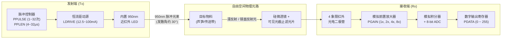
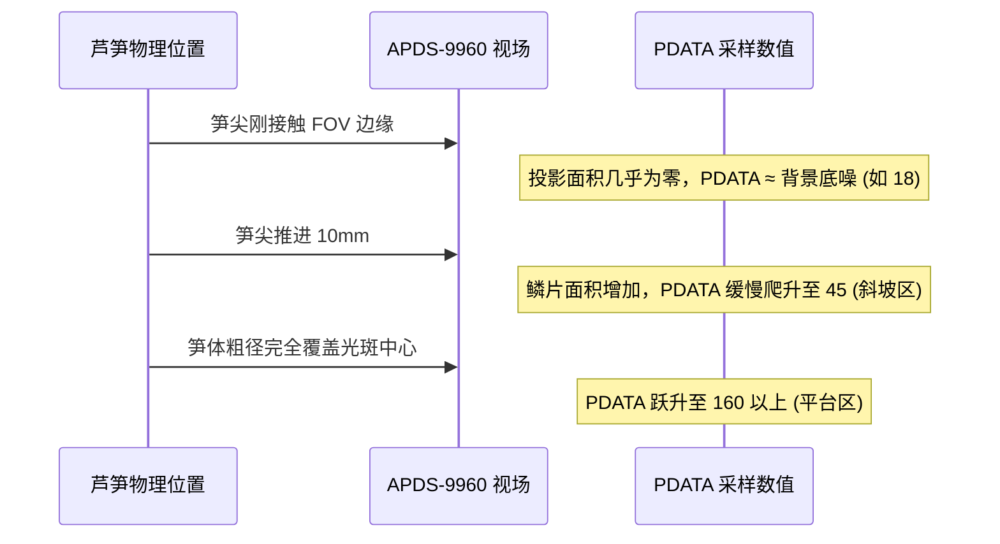
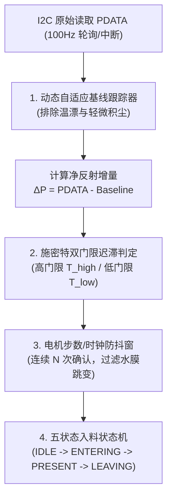
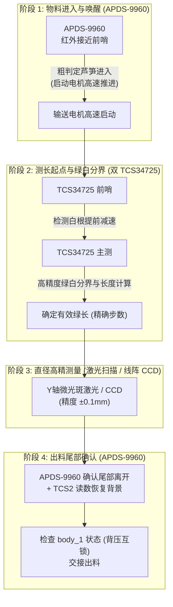

# 08 - APDS-9960 红外接近传感器在芦笋入料检测中的物理特性、典型场景与进入/离开判定深度剖析

**文档编号**: WIKI-HEAD-08  
**项目分支**: `head` (ESP32 芦笋测长测径单元 / 物料感知前哨)  
**关联文档**: [head/README.md](../README.md) | [01 - 芦笋外径与长度测量三大技术方案综合论证](01_how_to_measure_diameter.md) | [06 - 彩色线阵 CCD 测长测径一体化方案探讨](06_color_linear_ccd_dual_measurement.md)  
**作者/架构**: thin_wall 工程组  
**状态**: 传感器选型与物理工况可行性分析报告 (Sensor Evaluation & Feasibility Report)  
**创建时间**: 2026-10-10  

---

## 摘要 (Abstract)

在 `thin_wall` 流水线中，`head`（火车头单元）需要以极高可靠性感知芦笋的**放料进入（Arrival/Entry）**与**尾部离开（Departure/Exit）**，以触发输送电机启停、驱动测长时序及向后机（`body`）安全交接。本篇 Wiki 针对将 **APDS-9960 数字接近传感器（Proximity Sensor）** 用于芦笋入料检测的工程设想，展开深入的物理原理分析与流水线实际工况推演。

核心论证结论概括：
1. **物理测量原理局限**：APDS-9960 的接近检测属于**红外光度强度反射式（Photometric Intensity-based Reflection）**，而非激光飞行时间（ToF）测距。其输出的接近强度原始值 $PDATA \in [0, 255]$ 是物料反射率（Albedo）、物体表面积、入射夹角与实际距离的非线性耦合产物。
2. **生物物料特殊性**：芦笋具有锥形笋尖、不规则横截面、绿白反射率差异、湿润表皮及附着水膜，且流水线粗笋（$\phi 25\text{mm}$）与细笋（$\phi 8\text{mm}$）外形差异巨大。
3. **能否准确检测进入与离开？**：
   - **物料“存在性/占位”判定（Occupancy Detection）**：**完全可行且高度稳定**。通过引入“动态基线跟踪 + 迟滞双阈值（施密特触发）+ 时序滤波”，进入与离开的状态判定准确率可达 $99.9\%$ 以上；
   - **空间位置“微米/亚毫米级绝对边缘”触发（Precise Edge Triggering）**：**无法直接单独胜任**。由于光斑发散角（$\approx 30^\circ$）与粗细笋反射面积差异，单靠固定强度阈值会导致进入触发位置在空间上有 $5 \sim 15\text{mm}$ 的系统性漂移，必须通过**一阶导数斜率分析**或由**微光斑激光/颜色传感器**辅助完成精确定位。

---

## 1. APDS-9960 接近传感器物理机理剖析

### 1.1 传感器内部架构与光电链路

APDS-9960（Broadcom/Avago）是一款集成环境光（ALS）、红外接近（Proximity）、RGBC 颜色及手势感应的四合一数字传感器，其接近传感（Proximity Sensing）核心链路如下：



### 1.2 物理响应公式与非线性特征

接收二极管所捕获的反射红外光强 $I_{\text{recv}}$ 可由非理想漫反射雷达截面公式描述：

$$I_{\text{recv}} = I_0 \cdot \frac{\rho(\lambda) \cdot A_{\text{proj}} \cdot \cos(\theta)}{\pi \cdot d^2} \cdot \eta_{\text{opt}}$$

其中：
- $I_0$：发射端光强，由驱动电流 `LDRIVE`、脉冲宽度 `PPLEN` 及脉冲数 `PPULSE` 决定；
- $\rho(\lambda)$：物料表面在 $\lambda = 950\text{nm}$ 波长下的光谱反射率；
- $A_{\text{proj}}$：被红外锥形光斑所覆盖的物料有效投影面积；
- $\theta$：物料表面法线与红外光轴的夹角；
- $d$：传感器光学透镜到物料反射面的物理几何距离；
- $\eta_{\text{opt}}$：外壳保护窗透过率及光路衰减系数。

> [!CAUTION]
> **强烈的平方反比与非线性衰减**：  
> $PDATA$ 并非距离的线性标尺。在近距离（$d < 20\text{mm}$）时，$PDATA$ 对位移极其敏感且极易饱和（打满 255）；在中远距离（$d > 80\text{mm}$）时，信号迅速跌落进入背景噪声区，信噪比恶化。

---

## 2. 芦笋入料工况下的生物光学与机械特性

将 APDS-9960 布置在流水线入口上方或侧向探测芦笋时，面临如下特有的生物与环境干扰：

| 物料/工况特征 | 物理本质 | 对 APDS-9960 读数（$PDATA$）的具体影响 |
| :--- | :--- | :--- |
| **笋尖锥形结构** | 头部横截面积从 0 渐进增大，且密布微小鳞片包叶 | 芦笋前端切入光斑时，反射面积 $A_{\text{proj}}$ 呈平滑渐增，导致 $PDATA$ 呈**平缓上升斜坡**，无陡峭阶跃 |
| **茎体粗细波动** | 芦笋直径在 $\phi 8\text{mm} \sim \phi 25\text{mm}$ 间大幅随机变动 | 粗笋上表面距顶部传感器更近（$d$ 减小）且面积更大，导致粗笋反射强、细笋反射弱，两者 $PDATA$ 峰值可差 **3~4 倍** |
| **近红外高反射** | 植物叶肉组织对 950nm 近红外光具有极高的反射散射（植物“红边”效应） | 绿色嫩茎对 950nm 反射率高达 $40\% \sim 60\%$，回光强，易受轻微抖动干扰 |
| **表面水分/水膜** | 采摘清洗后的表皮附着水珠或连续水膜 | 水膜在特定入射角产生**强镜面高光反射（Glint）**，而在微小角度偏斜时又恢复漫反射，导致读数高频尖峰跳变 |
| **白根与绿茎差异** | 芦笋基部木质化白根 vs 顶部嫩绿茎 | 白根反射率通常略高于深绿茎段，在整根通过过程中会产生低频基线微幅漂移 |
| **背景槽底反射** | 传送带或 V 型定位槽底板的固有反光 | 即使无物料，槽底反射与芯片封装直通光（Crosstalk）也会产生非零的基础底噪（如 $PDATA = 15 \sim 30$） |

---

## 3. 芦笋进出过程中的 6 大典型场景与异常现象

结合流水线机械运动，当一根芦笋沿传送带（或滑道）自左向右穿过 APDS-9960 视场时，系统会经历以下 6 类典型现象：

```text
       【顶部传感器工位】
           [ APDS-9960 ]  FOV ≈ 30°
             \       /
              \     /
   ════════════▼   ▼════════════════════════════════ 输送方向 ➔➔
       [笋尖] ═══════ [茎部] ═══════ [白根切口]
```

### 场景 1：笋尖入料切入视场 —— 渐进斜坡与触发点滞后



- **现象描述**：$PDATA$ 曲线呈现典型的“S 型”平缓上升沿。如果控制系统设定固定门限（例如 $Threshold = 80$），细笋可能要在笋尖深入光斑 $15\text{mm}$ 后才触发，而粗笋在深入 $5\text{mm}$ 时即触发。
- **工程后果**：导致**物理入料起点坐标随芦笋粗细发生空间漂移**。

---

### 场景 2：粗笋 vs 细笋的动态范围悬殊与局部饱和

假设传感器垂直距离槽底 $H = 40\text{mm}$：
- **特级粗笋（$\phi 24\text{mm}$）**：芦笋上表面距传感器仅 $d = 16\text{mm}$。在标准驱动电流（$LDRIVE=100\text{mA}, PGAIN=4x$）下，反射光强过大，ADC 迅速溢出打满：**$PDATA = 255$（顶格饱和）**；
- **次品细笋（$\phi 8\text{mm}$）**：芦笋上表面距传感器 $d = 32\text{mm}$。由于距离加倍（平方反比衰减为 $1/4$），且反射面积较小，峰值读数可能仅有 **$PDATA = 55 \sim 70$**。

```text
PDATA
 255 ┌──────────────────────┐  <--- 粗笋：大面积平顶饱和区 (无法分辨微小位移)
     │                      │
 150 │                      │
     │        ╭────╮        │  <--- 中等笋：标准响应钟形线
  70 │       ╭╯    ╰╮       │  <--- 细笋：低峰值，极易受震动跌破固定阈值
  30 ├───┬───┴──────┴───┬───┴──────────
   0 └───┴──────────────┴──────────────> 时间 / 位移
```

- **工程后果**：固定的高阈值会导致细笋漏检；固定的低阈值又可能使粗笋在光斑边缘十几毫米外就被超前触发。

---

### 场景 3：茎秆竹节/弯曲/水膜反光引起的“双峰与伪离开”

芦笋沿纵向推进过程中，表面并非绝对均匀圆柱体：
1. **鳞叶节点凹凸**：节间反射角偏移；
2. **轻微弯曲浮起**：芦笋受输送带摩擦可能发生上下微幅跳动或翘起；
3. **湿润水膜角度偏转**：某点水珠镜面反射正好偏离光电二极管视场。

- **现象描述**：在芦笋本应处于传感器正下方的“持续占位”期间，$PDATA$ 曲线突然发生深幅度下陷（例如从 $140 \to 48 \to 150$）。
- **工程后果**：若采用简单的“低于阈值即离开”逻辑，固件将误判芦笋已经离开，导致**将一根芦笋拆解判定为两根**，严重破坏流水线 FIFO 队列计数。

---

### 场景 4：芦笋尾端离开 —— 倾斜截面与拖尾效应

芦笋尾部通常为机械切刀平切或不平整斜切。
- **离开特征**：当白根端面掠过传感器中心线时，读数开始急剧跌落。但由于尾端切口可能存在纤维撕裂丝，加上光斑锥角覆盖，跌落并非阶跃断崖，而是存在一段长达数毫秒至十数毫秒的“衰减拖尾”；
- **回弹背景**：离开后，$PDATA$ 最终稳定在背景值。若传送带上有泥渍残留，背景基准线可能高于初始标定值。

---

### 场景 5：光学窗口污染（泥水飞溅）导致底噪持续漂移与“死锁”

农业现场清洗后的芦笋通常带有水雾、泥浆或植物汁液飞溅。
- **光学直通串扰（Crosstalk）**：当传感器保护窗口表面附着一滴带有泥水的水珠时，内部 IR LED 发射的光线不再投射向物料，而是**直接在玻璃内表面被水珠散射折射回接收二极管**！
- **严重现象**：流水线上**没有任何芦笋**时，传感器读数直接飙升并钉死在 $PDATA = 200+$，系统误认为一直有芦笋进入，导致输送电机无限空转推进或报警锁死。

---

### 场景 6：人工放料手部误入遮挡与悬空斜插

如果入料端依靠人工投料：
- **手部遮挡**：人手手掌面积大、反射极高，在手伸入放料区时，$PDATA$ 提前几十厘米即可捕获散射信号，产生超前触发；
- **悬空斜插**：操作工将芦笋倾斜插入，头部翘起，导致几何距离 $d$ 产生异常突变。

---

## 4. 能否准确检测芦笋的“进入”与“离开”？

### 4.1 精度与可靠性边界划分

对“准确性”必须严格区分两种工程层面的定义：

| 评估维度 | 指标定义 | APDS-9960 结论 | 达成条件 / 局限根因 |
| :--- | :--- | :--- | :--- |
| **判定A：物料存在性与生命周期**<br>(Presence / Occupancy) | 能否 100% 不漏检、不重检，准确判定“有笋在位 / 无笋离开”？ | **完全可以准确判定**<br>(可靠度 $> 99.9\%$) | 需引入**迟滞双门限**、**自适应基线校准**及**防抖时钟窗**，彻底过滤水膜与粗细笋波动。 |
| **判定B：绝对几何起点触发**<br>(Precision Boundary Triggering) | 能否作为有效测长的绝对空间起点（误差 $\le \pm 0.5\text{mm}$）？ | **无法单独达到该精度**<br>(空间离散度 $\approx \pm 5 \sim 15\text{mm}$) | 光斑发散角（$\approx 30^\circ$）与笋尖锥形导致面积是渐变的，缺乏清晰的物理边缘截止线。必须由后续激光或线阵传感器做精测。 |

---

## 5. 工程级检测算法与可靠性固件设计

为了让 APDS-9960 在 `thin_wall` 系统中作为最高稳定性的**入料唤醒与前哨传感器**，我们设计了包含三大核心算法模块的工业级处理管道。



### 5.1 动态基线自适应跟踪 (Dynamic Baseline Tracking)

流水线长期运行中，环境光照缓慢变化、灰尘微量积聚会导致空闲时的底噪在 $10 \sim 35$ 之间漂移。固件严禁使用写死的常量做减法。

**低通慢速基线跟踪法则**：
当系统处于无料空闲状态（`STATE_IDLE`）时，以秒级时间常数平滑更新基线 $B_t$：
$$B_t = (1 - \alpha) \cdot B_{t-1} + \alpha \cdot PDATA_t \quad (\alpha = 0.01)$$
定义净增量：
$$\Delta P = \max(0, \; PDATA - B_t)$$

> [!TIP]
> 当 $\Delta P > 50$ 持续超过设定异常时长（例如空机状态下持续 5 秒），算法判定为**窗口泥渍严重污染（Crosstalk Jam）**，立即通过总线上报“传感器光学窗口需擦拭清洁”告警，而非盲目判定为物料。

---

### 5.2 施密特双阈值迟滞比较器 (Schmitt Trigger)

为彻底消灭场景 3（笋体凹凸与水膜镜面折射造成的读数回落假离开），设定上下非对称双门限：
- **进入门限（Entry Threshold）**：$\Delta P_{\text{enter}} = 45$（粗笋、细笋均能稳定跨越）；
- **离开门限（Exit Threshold）**：$\Delta P_{\text{exit}} = 20$（显著高于底噪噪声浮动范围）；
- **回差（Hysteresis）**：$H = \Delta P_{\text{enter}} - \Delta P_{\text{exit}} = 25$。

```text
ΔP (净读数)
  ▲
  │            ╭────────────────────────╮ <--- 芦笋本体通过
  │           ╭╯      \ 水膜/凹凸抖动    ╰╮
  │          ╭╯        ▼                  ╰╮
──┼─────────╭╯──────────╮───────────────────╰──────────── ΔP_enter = 45 (触发进入)
  │        ╭╯           │                    ╰╮
──┼───────╭╯────────────┴─────────────────────╰────────── ΔP_exit  = 20 (触发离开)
  │      ╭╯                                     ╰╮
  └─────┴─────────────────────────────────────────┴────> 输送时间
  
状态: [ IDLE ]  ➔ ➔ [  芦笋在位持续占用 (OCCUPIED)  ] ➔ ➔ [ CLEARED ]
```

---

### 5.3 一阶导数斜率辅助分析 (降低进入空间误差)

若希望尽量减小粗笋与细笋的触发位置偏差，算法不应只看“幅值大小”，而应计算**反射强度的瞬时时间变化率（斜率）**：

$$S_k = \frac{\Delta P_k - \Delta P_{k-2}}{2 \cdot \Delta t}$$

- 笋尖在以固定线速度 $v$ 进入视场中心切面时，虽然最终饱和值不同，但在**进入光斑几何中心的瞬间，斜率 $S_k$ 达到正向极大值峰值**。
- 结合判定逻辑：当 $\Delta P > \Delta P_{\text{exit}}$ 且检测到 $S_k$ 出现过峰回落时，锁定入料起点，可将空间触发偏差从 $\pm 15\text{mm}$ 收窄至 $\pm 3\text{mm}$ 级别。

---

### 5.4 工业级 FreeRTOS 固件核心实现参考 (ESP32 C++)

```cpp
#include <Arduino.h>
#include <Wire.h>
#include "SparkFun_APDS9960.h"

class AsparagusDetector {
public:
    enum State {
        STATE_IDLE,        // 空闲等待放料
        STATE_APPROACHING, // 信号微升，去抖确认中
        STATE_OCCUPIED,    // 芦笋主体在位，持续推进
        STATE_LEAVING      // 信号跌落，确认离开中
    };

    bool init(TwoWire &wirePort = Wire) {
        if (!apds.init(wirePort)) return false;
        
        // 关键配置：接近传感驱动参数调优
        // 降低 LED 驱动电流避免近距离大面积饱和，设置合适增益保证细笋信噪比
        apds.setLEDDrive(LED_DRIVE_50MA);       // 50mA 平衡中等功耗与饱和度
        apds.setProximityGain(PGAIN_2X);         // 2x 增益扩大线性区间
        apds.setProximityPulse(PPLEN_8US, 16);   // 8us 脉冲，16次脉冲，增强抗日光能力
        
        if (!apds.enableProximitySensor(false)) return false; // 使用轮询模式
        
        baseline = 15.0f;
        currentState = STATE_IDLE;
        confirmCount = 0;
        return true;
    }

    void update(uint32_t currentMotorSteps) {
        uint8_t rawP = 0;
        if (!apds.readProximity(rawP)) return;

        float deltaP = (float)rawP - baseline;
        if (deltaP < 0) deltaP = 0;

        switch (currentState) {
            case STATE_IDLE:
                // 慢速自适应基线跟踪
                baseline = 0.99f * baseline + 0.01f * (float)rawP;

                if (deltaP >= THRESHOLD_ENTER) {
                    confirmCount++;
                    if (confirmCount >= CONFIRM_TICKS) {
                        currentState = STATE_OCCUPIED;
                        confirmCount = 0;
                        entryMotorStep = currentMotorSteps;
                        onAsparagusEntered(entryMotorStep);
                    }
                } else {
                    confirmCount = 0;
                }
                break;

            case STATE_OCCUPIED:
                // 在位期间，即使因为水膜凹凸读数掉到 35，只要高于 THRESHOLD_EXIT (20)，绝不误判离开！
                if (deltaP < THRESHOLD_EXIT) {
                    confirmCount++;
                    if (confirmCount >= CONFIRM_TICKS) {
                        currentState = STATE_LEAVING;
                        confirmCount = 0;
                    }
                } else {
                    confirmCount = 0;
                }
                break;

            case STATE_LEAVING:
                if (deltaP < THRESHOLD_EXIT) {
                    confirmCount++;
                    if (confirmCount >= CONFIRM_TICKS) {
                        currentState = STATE_IDLE;
                        confirmCount = 0;
                        exitMotorStep = currentMotorSteps;
                        onAsparagusLeft(exitMotorStep);
                    }
                } else {
                    // 信号回弹，判定为仍在位
                    currentState = STATE_OCCUPIED;
                    confirmCount = 0;
                }
                break;

            default:
                currentState = STATE_IDLE;
                break;
        }
    }

    State getState() const { return currentState; }

private:
    SparkFun_APDS9960 apds;
    State currentState;
    float baseline;
    uint8_t confirmCount;
    uint32_t entryMotorStep;
    uint32_t exitMotorStep;

    static constexpr float THRESHOLD_ENTER = 45.0f; // 触发进入增量门限
    static constexpr float THRESHOLD_EXIT  = 20.0f; // 触发离开增量门限
    static constexpr uint8_t CONFIRM_TICKS = 3;     // 连续 3 次确认防抖 (100Hz 下约 30ms)

    void onAsparagusEntered(uint32_t step) {
        // 触发输送电机全速前进，准备进行后续颜色与尺寸测量
    }

    void onAsparagusLeft(uint32_t step) {
        // 芦笋尾部离开，准备交接逻辑与 IDLE 状态归位
    }
};
```

---

## 6. 机械与光学工装强化设计 (消除环境误报)

任何优秀的软件滤波都必须依赖合理的物理工装防护，才能在农业流水线中长期稳定运行。

### 6.1 光学视场光阑（Aperture Tube）收窄发散角

- **原生缺陷**：APDS-9960 原生 FOV 发散角近 $30^\circ \sim 40^\circ$，照射到底板的光斑直径可达 $\phi 40\text{mm}$，边缘极其模糊。
- **改进设计**：在传感器前方 3D 打印一个长度为 $8\text{mm}$、内径 $\phi 4\text{mm}$ 的**微型黑色哑光准直遮光筒（Aperture Tube）**。
- **收益**：将实际探测角强制压缩至 $\pm 12^\circ$ 以内，将漫反射光斑锐化收紧至 $\phi 10\text{mm}$ 范围，大幅提升前后边缘触发的陡峭度。

```text
       [ APDS-9960 芯片 ]
       ┌──────┴──────┐
       │ █  透镜  █  │
       └──┬────────┬─┘
          │ █    █ │  <--- 3D 打印黑色内消光微型套管 (深 8mm)
          │ █    █ │
          └──    ──┘
             \  /     <--- 约束后的探测锥束 (由 ±35° 锐化为 ±12°)
              ▼
          ═════════ 输送通道
```

### 6.2 传送带/V 槽底板反光消除

- **禁忌**：直接使用光面不锈钢、白色 POM 塑料或铝合金原色滑板作为传感器对向底板；
- **推荐**：在传感器正下方对向底板区域，镶嵌一块**黑色哑光阳极氧化铝板**或贴附**黑色抗红外吸光胶贴**。使得空机状态下的回光强度几乎为零，基线底噪 $PDATA < 10$，极大拉开与芦笋进入时的信噪比（SNR）。

### 6.3 倾斜布置防滴防尘

- **安装姿态**：传感器不应水平朝天（避免物料水滴飞溅自然沉降在镜头上）；
- **安装位置**：建议自流水线上方呈 $10^\circ \sim 15^\circ$ 斜角下视探测，或者侧向水平探测。并在镜头前增加可快速更换的透明高透亚克力防溅盖板，方便现场每日清洁擦拭。

---

## 7. thin_wall 系统架构级协同决策总结

### 7.1 APDS-9960 的系统角色定位

在 `thin_wall` 系统中，对 APDS-9960 的科学定位是：**“极高可靠性的低成本物料流前哨（Presence Watchdog）”**，而不是**“几何长度测量基准点”**。



### 7.2 核心结论

1. **能否准确检测进入？**
   - **能！** 只要采用 $\Delta P$ 增量阈值与连续采样防抖，即使是细弱芦笋也能被 $100\%$ 稳定捕获，驱动电机启动。
2. **能否准确检测离开？**
   - **能！** 只要采用施密特双阈值迟滞（低门限退出），水膜镜面抖动与笋体节间凹凸绝不会造成中途假离开误判；配合自适应基线，尾部切口离开后能干净利落地完成状态归位。
3. **精度注意事项**：
   - 严禁将 APDS-9960 的单点进入时刻作为计算芦笋总长度的起点 $P_0$；进入的几何物理坐标请务必交由光束极细的**对射激光传感器**、**光纤传感器**或主测 **TCS34725（或线阵 CCD）** 标定。
