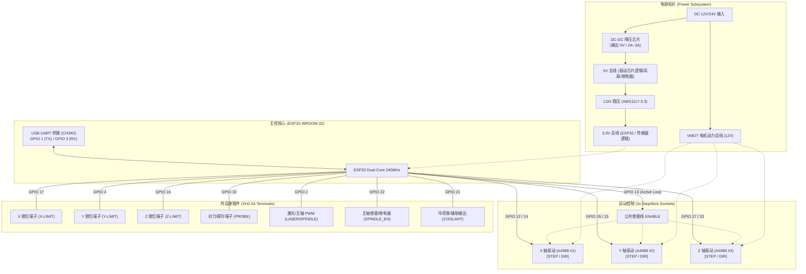
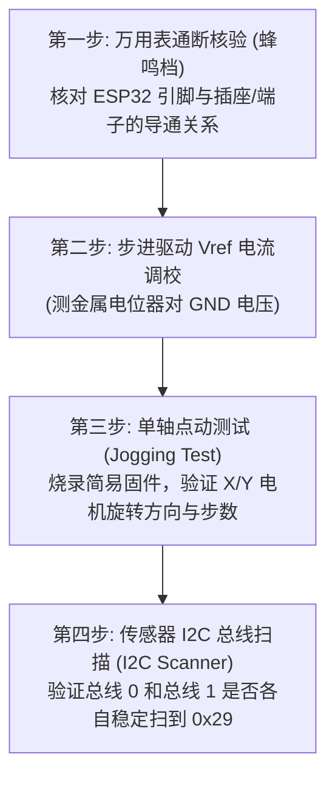

# 09 - YoraHome ESP32 (Gerber 1.3A) 现成三轴主板硬件架构、引脚定义 (GPIO) 与 head 单元测试适配全景剖析

**文档编号**: WIKI-HEAD-09  
**项目分支**: `head` (ESP32 芦笋测长测径单元 / 控制与驱动验证)  
**关联文档**: [head/README.md](../README.md) | [head/src/config.h](../src/config.h) | [01 - 芦笋外径与长度测量三大技术方案综合论证](01_how_to_measure_diameter.md)  
**作者/架构**: thin_wall 工程组  
**状态**: 现成测试板引脚分配与系统适配规范 (Hardware Pinout & Commissioning Guide)  
**创建时间**: 2026-10-10  

---

## 摘要 (Abstract)

在 `thin_wall` 系统 `head`（火车头单元）的原型验证与早期测试阶段，若直接设计并打样专用自定义 PCB，周期较长且调试风险高。采用一块市售成熟的 **YoraHome ESP32 CNC/激光雕刻机 32 位三轴主板**（PCB 丝印标有 `YoraHome ESP32`、`Gerber 1.3A` / `v1.3a`），能够以极低成本快速建立硬件测试台架。

该线路板集成了 **ESP32-WROOM-32** 主控、**3 路步进电机驱动插座 (标准 StepStick 封装，适配 A4988 / DRV8825 / TMC2209)**、**12V/24V 转 5V/3.3V DC-DC 电源拓扑** 以及 **USB-UART 调试接口**。

本篇 Wiki 针对该主板展开深度逆向剖析与资料汇总：
1. **硬件拓扑与主板架构**：解析其供电、主控、驱动插槽及外设端子布局；
2. **完整 GPIO 引脚映射表**：梳理 X/Y/Z 三轴驱动信号（STEP/DIR/EN）、限位开关输入、激光/主轴控制、PROBE 对刀引脚以及通用 I/O 分布；
3. **ESP32 特殊引脚 (Strapping Pins) 避坑要点**：剖析 GPIO 12、GPIO 0、GPIO 2 等电平约束对固件启动与驱动器配置的影响；
4. **适配 `head` 单元的引脚复用方案**：如何在不改动板载铜皮走线的前提下，巧妙将该主板的端子引出，完美复用于 `head` 的**双步进控制 (输送电机 + Y 轴测径)**、**双硬件 I2C 颜色传感器 (TCS34725 #1 & #2)**、**激光测径信号**与**向下游 `body` 串口通信**；
5. **软硬件调试与上电实测规程**：提供 Vref 调校公式、引脚蜂鸣器核验法及针对 `config.h` 的宏定义切换指引。

---

## 1. YoraHome ESP32 (Gerber 1.3A) 物理规格与硬件拓扑

### 1.1 主板硬件特性概览

| 硬件维度 | 规格参数 | 详细说明 |
| :--- | :--- | :--- |
| **主控芯片** | ESP32-WROOM-32 (或 ESP32-WROOM-32D/U) | 双核 32 位 Xtensa LX6，240MHz，520KB SRAM，4MB SPI Flash |
| **电路板版本** | Gerber 1.3A / Rev 1.3a | 常见于 YoraHome CNC 3018-Pro / 6550 系列 32 位升级板 |
| **供电输入** | DC 12V ~ 24V (标准 DC005 插座 / 接线柱端子) | 经板载 DC-DC 降压输出 5V（逻辑驱动），再经 LDO 稳压出 3.3V 供 ESP32 |
| **步进驱动插槽** | 3 组标准 StepStick (Pololu 2x8 Pin) | 分别对应 X、Y、Z 三轴，支持 A4988、DRV8825、TMC2208/2209 等 |
| **微步细分调节** | 板载跳线帽 (MS1, MS2, MS3) | 每个驱动插座下方自带 3 组跳线，可硬跳线设置 1/16 (A4988) 或 1/32 (DRV8825) |
| **通信接口** | USB Type-B / Micro-USB / Type-C (CH340G / CP2102) | 对应 ESP32 默认调试串口 `UART0` (GPIO 1 / 3) |
| **外设接口端子** | X-LIM, Y-LIM, Z-LIM, PROBE, LASER/SPINDLE | 均为 XH2.54 或 PH2.0 规格排针，带板载上拉与滤波电容 |
| **散热支持** | 驱动区上方支持加装专用 12V 降温风扇 | 延长步进驱动大电流工况寿命 |

### 1.2 系统架构框图



---

## 2. 官方标准固件 (Grbl_ESP32 / FluidNC) GPIO 引脚定义总表

该类 ESP32 三轴 CNC 主板遵循开源运动控制器领域最为广泛采纳的 **Bart Dring (Buildlog.net) 3-Axis CNC Controller (v4 / 3axis_v4)** 经典硬件标准。

下表列出其**默认底层硬件走线与引脚分配**：

| 功能模块 | 信号名称 | ESP32 GPIO | 默认电气属性 | 物理排针 / 插座位置 | 备注与注意事项 |
| :--- | :--- | :--- | :--- | :--- | :--- |
| **X 轴电机** | `X_STEP` | **GPIO 12** | 输出，高脉冲有效 | X 驱动座 Pin 7 | **重要 Strapping 引脚** (MTDI)，见第 3 节 |
| | `X_DIR` | **GPIO 14** | 输出，电平定方向 | X 驱动座 Pin 8 | 通用推挽输出 |
| **Y 轴电机** | `Y_STEP` | **GPIO 26** | 输出，高脉冲有效 | Y 驱动座 Pin 7 | 通用 DAC/GPIO |
| | `Y_DIR` | **GPIO 15** | 输出，电平定方向 | Y 驱动座 Pin 8 | **Strapping 引脚** (MTDO)，上电拉高关闭调试输出 |
| **Z 轴电机** | `Z_STEP` | **GPIO 27** | 输出，高脉冲有效 | Z 驱动座 Pin 7 | 通用推挽输出 |
| | `Z_DIR` | **GPIO 33** | 输出，电平定方向 | Z 驱动座 Pin 8 | 通用推挽输出 |
| **全局使能** | `STEP_EN` | **GPIO 13** | 输出，低电平使能 (`LOW`) | 三轴驱动座 Pin 1 (并联) | 板载上拉电阻，未使能时浮空锁定 |
| **X 限位** | `X_LIMIT` | **GPIO 17** | 输入，内部/板载上拉 | X-LIM 2Pin 端子 | 外部开关触发至 GND |
| **Y 限位** | `Y_LIMIT` | **GPIO 4** | 输入，内部/板载上拉 | Y-LIM 2Pin 端子 | 外部开关触发至 GND |
| **Z 限位** | `Z_LIMIT` | **GPIO 16** | 输入，内部/板载上拉 | Z-LIM 2Pin 端子 | 外部开关触发至 GND |
| **对刀探针** | `PROBE` | **GPIO 32** | 输入，内部/板载上拉 | PROBE 2Pin 端子 | 外部对刀块碰触至 GND |
| **激光/主轴** | `SPINDLE_PWM` | **GPIO 2** | 输出，PWM 调速 (0~100%) | LASER / PWM 端子 | **Strapping 引脚** (上电不能强拉高) |
| **主轴使能** | `SPINDLE_EN` | **GPIO 22** | 输出，高电平开主轴 | MOSFET / 继电器端口 | 板载带下拉电阻 |
| **冷却控制** | `COOLANT` | **GPIO 21** | 输出，高电平开气阀 | MIST / COOLANT 端子 | 常用于控制吹气气阀 |
| **USB 调试** | `UART0_TX` | **GPIO 1** | 输出 (115200) | CH340 USB 芯片 | 烧录固件与 Serial 打印 |
| | `UART0_RX` | **GPIO 3** | 输入 (115200) | CH340 USB 芯片 | 烧录固件与 Serial 接收 |

> [!NOTE]
> **关于 I2S 扩展芯片的辨识**：
> 市场上另有一款 Makerbase 推出的 MKS DLC32 系列主板，采用 74HC595 移位寄存器并由 I2S 总线驱动 STEP/DIR。
> **快速区分方法**：观察主板 ESP32 模块周围是否有贴片 74HC595 芯片。若没有 74HC595，且步进驱动插座的 STEP/DIR 引脚直接穿孔连接至 ESP32 模组引脚，则属于上表所述的标准 **Direct GPIO (直驱型)** 主板。本板属于直驱型。

---

## 3. ESP32 关键引脚约束与硬件避坑指南 (Gotchas)

在直接控制该主板的各路 GPIO 时，必须避开 ESP32 固有的自举引脚（Boot Strapping Pins）陷阱：

### 3.1 GPIO 12 (MTDI) —— 最核心的启动陷阱
*   **物理机制**：ESP32 上电复位瞬间，芯片内部 ROM 会采样 GPIO 12 的电平。若为低电平（默认），Flash 供电电压为 **3.3V**（常规模组）；若被强制拉高，Flash 供电电压切换为 **1.8V**，导致 Flash 读不出代码而陷入死循环（Bootloop 报错 `rst:0x10 (RTCWDT_RTC_RESET)`）。
*   **A4988 驱动器影响**：部分劣质 A4988 模块的 STEP 引脚内部带有弱上拉电阻。插在 X 轴插座上时，若把 GPIO 12 抬高超过阈值，主板将无法开机。
*   **解决方案**：
    1. 确保主板上 GPIO 12 对地有 $10\text{k}\Omega$ 下拉电阻（YoraHome 原装板通常已设计就绪）；
    2. 若遇开机红灯常亮不启动，拔掉 X 轴驱动模块即可确诊是否为此问题。

### 3.2 GPIO 2 —— 板载 LED / 激光 PWM
*   ESP32 下载模式要求 GPIO 2 浮空或拉低。
*   板载通常连接激光 PWM 输出口及一颗测试 LED。如果外接的光耦或上拉电路在启动瞬间强行把 GPIO 2 拉至高电平，可能会导致无法进入串口烧录。

### 3.3 GPIO 13 —— 全局使能 (Shared Stepper Enable)
*   三路步进驱动插座的 `ENABLE` 引脚（Pin 1）在主板底层是**并联在一起的**，统一由 **GPIO 13** 控制。
*   A4988 / DRV8825 均为**低电平使能**（`LOW` = 驱动器输出开，电机锁轴；`HIGH` = 驱动器关断，电机自由旋转）。
*   **工程意义**：输送电机与 Y 轴电机无法在电气上单独彻底掉电（除非只发脉冲不使能），这在 `head` 中没有不良影响——保持锁轴有助于防止停机测径时传送带发生回退或移位。

---

## 4. `head` 单元在 YoraHome 主板上的引脚映射方案

`head` 单元需要满足的核心硬件接口包括：
1. **输送步进电机 (CONVEYOR)**：单向推料测长；
2. **Y 轴测径步进电机 (Y-AXIS)**：横向往复扫描；
3. **两路独立硬件 I2C 颜色传感器 (TCS34725 #1 & #2)**：地址均为 `0x29`，必须走两条独立 I2C 总线；
4. **两路补光常亮控制 (LED_CTRL_1, LED_CTRL_2)**；
5. **Y 轴原点限位开关 (Y_LIMIT)**；
6. **测径激光遮挡检测输入 (DIAM_LASER)**；
7. **向下游 `body` 通信的双向串口 (UART2)**。

通过巧妙利用该主板已暴露的外设端子排针，可实现**免改板、完全免飞线**的优雅对接：

### 4.1 端口复用与连线映射表

| `head` 功能需求 | 对应 `config.h` 宏 | YoraHome 主板物理接口 | ESP32 GPIO | 连线方式与说明 |
| :--- | :--- | :--- | :--- | :--- |
| **输送步进电机** | `CONVEYOR_STEP_PIN` | **X 轴驱动插槽** (Pin 7) | **GPIO 12** | 插上 A4988 模块，电机插 X 轴端子 |
| | `CONVEYOR_DIR_PIN` | **X 轴驱动插槽** (Pin 8) | **GPIO 14** | 输送电机方向控制 |
| | `CONVEYOR_EN_PIN` | **X/Y/Z 共用使能** (Pin 1) | **GPIO 13** | 低电平使能全局电机驱动 |
| **Y 轴扫径电机** | `Y_STEP_PIN` | **Y 轴驱动插槽** (Pin 7) | **GPIO 26** | 插上 A4988 模块，电机插 Y 轴端子 |
| | `Y_DIR_PIN` | **Y 轴驱动插槽** (Pin 8) | **GPIO 15** | Y 轴扫描方向控制 |
| | `Y_EN_PIN` | **X/Y/Z 共用使能** (Pin 1) | **GPIO 13** | 与输送电机共用使能 |
| **Z 轴 (备用)** | *(保留备用)* | **Z 轴驱动插槽** | STEP: 27 / DIR: 33 | 可用于未来推板出料或上下对刀 |
| **I2C_0 (前哨传感器 1)**| `I2C0_SDA_PIN` | **COOLANT (冷却) 端子** | **GPIO 21** | 默认 I2C0_SDA，直接接 TCS34725 #1 SDA |
| | `I2C0_SCL_PIN` | **SPINDLE_EN (主轴使能) 端子**| **GPIO 22** | 默认 I2C0_SCL，直接接 TCS34725 #1 SCL |
| **I2C_1 (精测传感器 2)**| `I2C1_SDA_PIN` | **Z-LIMIT (Z 限位) 端子** | **GPIO 16** | 映射为 I2C1_SDA，接 TCS34725 #2 SDA |
| | `I2C1_SCL_PIN` | **X-LIMIT (X 限位) 端子** | **GPIO 17** | 映射为 I2C1_SCL，接 TCS34725 #2 SCL |
| **Y 轴扫描回零限位** | `Y_LIMIT_PIN` | **Y-LIMIT (Y 限位) 端子** | **GPIO 4** | 微动开关常闭/常开接入，低电平触发 |
| **测径激光遮挡信号** | `DIAM_LASER_PIN` | **PROBE (对刀探针) 端子** | **GPIO 32** | 接收激光接收管遮挡电平信号 |
| **传感器 1 补光 LED** | `LED_CTRL_1_PIN` | **LASER / PWM 信号端子** | **GPIO 2** | 板载排针输出高电平驱动 LED 点亮 |
| **传感器 2 补光 LED** | `LED_CTRL_2_PIN` | **Z_DIR (或板载扩展排针)** | **GPIO 33** | (若使用 Z 驱动座 DIR 引脚输出高电平) |
| **状态指示灯 (LED)** | `STATUS_LED_PIN` | 板载测试 LED | **GPIO 2** | 与激光口并联，用于闪烁指示 |
| **数据串口 TX2 (往下游)**| `DATA_UART_TX_PIN` | 备用端子或扩展排针 | **GPIO 14** (注) | 需与 X_DIR 隔离，详见下文通信建议 |
| **数据串口 RX2 (收后机)**| `DATA_UART_RX_PIN` | SENSOR 备用输入 / GPIO 34 | **GPIO 34 / 35** | 仅输入引脚，适合接收后机广播包 |

> [!TIP]
> **关于双硬件 I2C 的绝妙复用**：
> ESP32 默认硬件 I2C_0 总线引脚恰好是 **GPIO 21 (SDA)** 与 **GPIO 22 (SCL)**。在 YoraHome 主板上，这两根引脚分别连接到 `COOLANT` 与 `SPINDLE_EN` 端子。只需将传感器 1 的 I2C 连线插到这两个端子，即可获得原生硬件 I2C 支持！
> 而传感器 2 所需的硬件 I2C_1，则直接复用 `Z-LIMIT (GPIO 16)` 与 `X-LIMIT (GPIO 17)`，这两个端子自带滤波抗干扰电容，非常适合长线 I2C 通信。

---

## 5. 代码层适配改造方案 (`config.h` 变更指引)

为将 `head` 固件直接烧录至 YoraHome 主板进行物理联调，建议在 [head/src/config.h](../src/config.h) 中增加宏配置分支，以便在开发板与该测试板之间自由切换：

```cpp
// ========================================================
// 硬件平台配置切换: 0 = 纯杜邦线开发板 (DevKitC), 1 = YoraHome 32位主板
// ========================================================
#define USE_YORAHOME_TEST_BOARD   1

#if USE_YORAHOME_TEST_BOARD

// I2C 总线 0 (复用 COOLANT 与 SPINDLE_EN)
#define I2C0_SDA_PIN            21
#define I2C0_SCL_PIN            22

// I2C 总线 1 (复用 Z-LIM 与 X-LIM 端子)
#define I2C1_SDA_PIN            16
#define I2C1_SCL_PIN            17

// 补光 LED 控制
#define LED_CTRL_1_PIN          2   // 复用 LASER 端子
#define LED_CTRL_2_PIN          33  // 复用 Z_DIR 信号

// 输送电机 (插 X 轴插座)
#define CONVEYOR_STEP_PIN       12
#define CONVEYOR_DIR_PIN        14
#define CONVEYOR_EN_PIN         13  // 全局共享使能

// Y 轴测径电机 (插 Y 轴插座)
#define Y_STEP_PIN              26
#define Y_DIR_PIN               15
#define Y_EN_PIN                13  // 全局共享使能

// 传感器与限位输入
#define Y_LIMIT_PIN             4   // Y-LIM 物理端子
#define DIAM_LASER_PIN          32  // PROBE 物理端子
#define STATUS_LED_PIN          2   // 板载蓝灯 (与 LASER 同步)

// 数据通信串口 (往下游 body 发送与监听)
#define DATA_UART_NUM           1   // 或利用空闲引脚
#define DATA_UART_TX_PIN        27  // 复用 Z_STEP 端口输出 TX
#define DATA_UART_RX_PIN        35  // 扩展输入端口 RX (仅输入)
#define DATA_UART_BAUD          115200

#else

// ... 保持原有纯开发板定义 (GPIO 18, 19, 23, 25, 26, 27 等) ...

#endif
```

---

## 6. 上电实测与调试规程 (Commissioning Workflow)

在将芦笋机构与传感器插上该主板前，必须严格执行以下四步调试流程：



### 6.1 万用表蜂鸣档核验关键点
1. **GND 全系统共地检查**：确认 DC 负极、USB 外壳、ESP32 屏蔽罩以及各传感器端子 GND 均直通阻抗 $< 0.5\Omega$；
2. **STEP/DIR 引脚导通确认**：
   - 探针一端接 ESP32 模组焊盘 GPIO 12，另一端点触 X 驱动座 Pin 7（STEP），确认蜂鸣器响；
   - 探针一端接 ESP32 模组焊盘 GPIO 26，另一端点触 Y 驱动座 Pin 7（STEP），确认蜂鸣器响；
3. **GPIO 12 对地阻抗**：量测 GPIO 12 对 GND 阻抗，应在 $10\text{k}\Omega$ 左右，若为短路或阻抗 $< 1\text{k}\Omega$，严禁上电。

### 6.2 A4988 步进驱动 Vref 调校公式
若使用常见的绿板/红板 A4988 步进驱动，驱动器输出相电流由检流电阻 $R_s$ 与电位器电压 $V_{\text{ref}}$ 决定：

$$I_{\text{tripMAX}} = \frac{V_{\text{ref}}}{8 \times R_s}$$

*   **常见检流电阻**：通常标有 `R100` ($0.10\Omega$) 或 `R050` ($0.05\Omega$)；
*   对于 42 步进电机（额定电流约 $1.0\text{A} \sim 1.3\text{A}$），若 $R_s = 0.1\Omega$：
    $$V_{\text{ref}} = 1.0\text{A} \times 8 \times 0.1\Omega = 0.80\text{V}$$
*   **调试方法**：数字万用表打到 DC 2V 档，黑表笔接主板 GND，红表笔接触螺丝刀头或贴片电位器金属顶端，用十字批微调至 **$0.75\text{V} \sim 0.85\text{V}$** 之间。顺时针通常为减小，逆时针为增大。

### 6.3 I2C 总线与传感器扫描验证
为保证两颗 TCS34725（地址均固定为 `0x29`）能正常并行工作，可在固件初始化阶段执行双总线扫描：

```cpp
#include <Wire.h>

void scanI2CBuses() {
    Wire.begin(I2C0_SDA_PIN, I2C0_SCL_PIN);
    Wire1.begin(I2C1_SDA_PIN, I2C1_SCL_PIN);

    Serial.println("--- 扫描 I2C_0 (前哨传感器) ---");
    Wire.beginTransmission(0x29);
    if (Wire.endTransmission() == 0) {
        Serial.println("[OK] TCS34725 #1 (前哨) 成功在线于 0x29");
    } else {
        Serial.println("[FAIL] I2C_0 未检测到设备，请检查 COOLANT/SPINDLE_EN 接线");
    }

    Serial.println("--- 扫描 I2C_1 (精测传感器) ---");
    Wire1.beginTransmission(0x29);
    if (Wire1.endTransmission() == 0) {
        Serial.println("[OK] TCS34725 #2 (主测) 成功在线于 0x29");
    } else {
        Serial.println("[FAIL] I2C_1 未检测到设备，请检查 Z-LIM/X-LIM 接线");
    }
}
```

---

## 7. 结论与下一步落地指引

1. **高度可用性**：该 YoraHome ESP32 (Gerber 1.3A) 主板是基于 Bart Dring 3-Axis CNC 开源标准的成熟商业化衍生品，硬件电气可靠度高，自带 12V 稳压与 3 路步进驱动插槽，非常适合充当 `head` 单元的原型测试载体；
2. **零硬件改动直接接入**：
   - 输送电机接入 **X 轴插座 (GPIO 12/14)**；
   - Y 轴扫径电机接入 **Y 轴插座 (GPIO 26/15)**；
   - 两路 I2C 颜色传感器分别由 **COOLANT/SPINDLE_EN (GPIO 21/22)** 与 **Z-LIM/X-LIM (GPIO 16/17)** 完美承载；
   - Y 轴回零接入 **Y-LIM (GPIO 4)**，激光信号接入 **PROBE (GPIO 32)**；
3. **下一步执行动作**：
   - 用户可先用万用表核验上述关键引脚的通断；
   - 在 `config.h` 中切至 `#define USE_YORAHOME_TEST_BOARD 1` 分支；
   - 执行 `pio run` 编译并烧录固件，启动双电机与传感器的联调测试。
